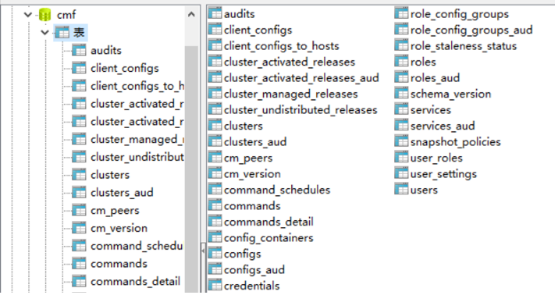
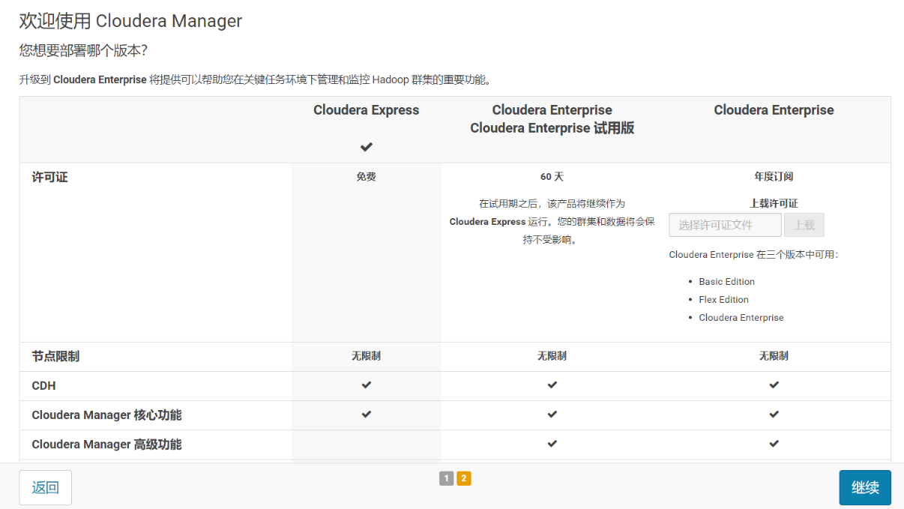
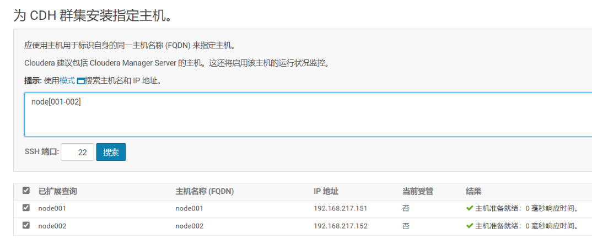
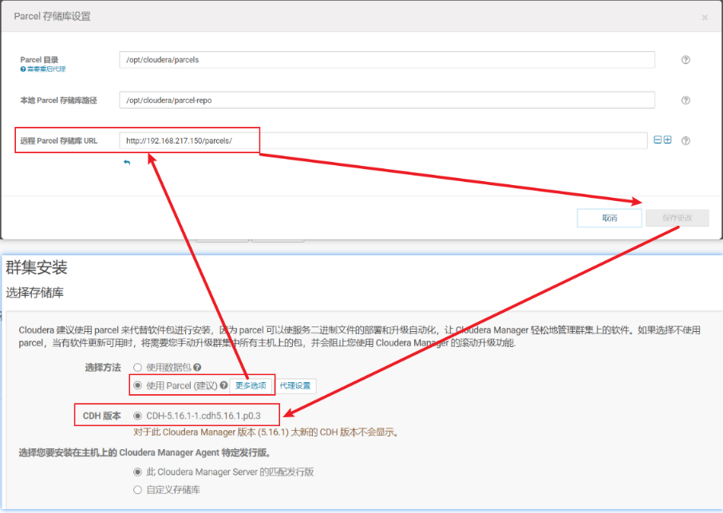
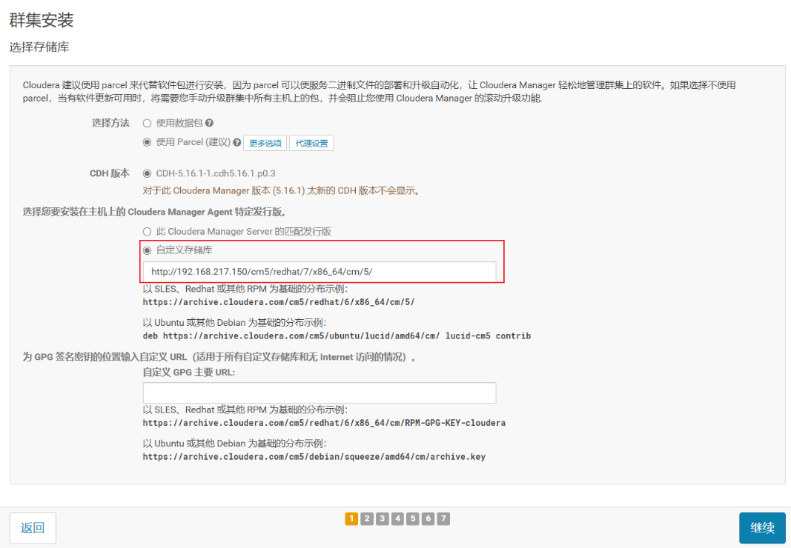
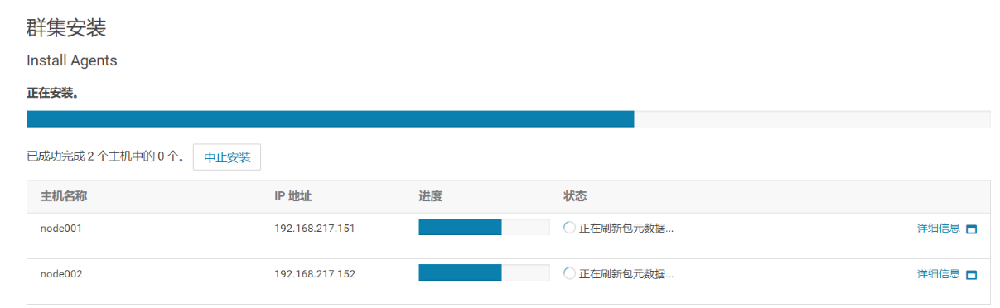

<!-- TOC -->

- [CDH](#cdh)
  - [资源下载](#资源下载)
  - [网络配置](#网络配置)
  - [时间同步及JDK](#时间同步及jdk)
    - [更改yum源](#更改yum源)
    - [时钟同步](#时钟同步)
    - [JDK安装](#jdk安装)
  - [mysql tar包离线安装](#mysql-tar包离线安装)
    - [创建用户](#创建用户)
    - [mysql.tar上传和解包](#mysqltar上传和解包)
    - [更改mysql所属用户和组](#更改mysql所属用户和组)
    - [修改my.cnf配置](#修改mycnf配置)
    - [安装和初始化](#安装和初始化)
    - [环境变量](#环境变量)
    - [修改密码](#修改密码)
    - [远程访问](#远程访问)
    - [开机启动](#开机启动)
  - [其他节点](#其他节点)
  - [免密登录](#免密登录)
  - [httpd服务](#httpd服务)
    - [安装httpd服务](#安装httpd服务)
    - [配置parcels](#配置parcels)
  - [安装CM的server和daemons](#安装cm的server和daemons)
  - [元数据库的创建](#元数据库的创建)
    - [创建与授权](#创建与授权)
    - [上传mysql-connector-java](#上传mysql-connector-java)
  - [启动cloudera-scm-server服务并查看日志](#启动cloudera-scm-server服务并查看日志)
  - [ClouderaManager管理](#clouderamanager管理)
    - [cm-web界面](#cm-web界面)
    - [CDH集群配置](#cdh集群配置)

<!-- /TOC -->

<a id="markdown-cdh" name="cdh"></a>
# CDH

<a id="markdown-资源下载" name="资源下载"></a>
## 资源下载

```
http://archive.cloudera.com/cm5/repo-as-tarball/5.16.1/cm5.16.1-centos7.tar.gz

http://archive.cloudera.com/cdh5/parcels/5.16.1/CDH-5.16.1-1.cdh5.16.1.p0.3-el7.parcel
http://archive.cloudera.com/cdh5/parcels/5.16.1/CDH-5.16.1-1.cdh5.16.1.p0.3-el7.parcel.sha1
http://archive.cloudera.com/cdh5/parcels/5.16.1/manifest.json
```

注意【CDH-5.16.1-1.cdh5.16.1.p0.3-el7.parcel.sha1】下载完成后需要将扩展名修改为【sha】

浏览器直接下载的话会很慢，可以采用百度云离线下载或者直接迅雷下载。

<a id="markdown-网络配置" name="网络配置"></a>
## 网络配置

参考 [网络配置](基础环境.md#网络配置)

<a id="markdown-时间同步及jdk" name="时间同步及jdk"></a>
## 时间同步及JDK
<a id="markdown-更改yum源" name="更改yum源"></a>
### 更改yum源

如果是centos最小安装，则需要通过yum安装wget
```shell
yum isntall -y wget
```

```shell
#备份原镜像
[root@master ~]# mv /etc/yum.repos.d/CentOS-Base.repo /etc/yum.repos.d/CentOS-Base.repo.backup
[root@master ~]# cd /etc/yum.repos.d/

#centos 7 
[root@localhost yum.repos.d]# wget http://mirrors.163.com/.help/CentOS7-Base-163.repo
#centos 6 
[root@localhost yum.repos.d]# wget http://mirrors.163.com/.help/CentOS6-Base-163.repo
#------------------------#
[root@localhost yum.repos.d]# yum clean all
[root@localhost yum.repos.d]# yum makecache
```

<a id="markdown-时钟同步" name="时钟同步"></a>
### 时钟同步

```shell
# 安装同步服务
[root@master ~] yum install -y ntp

# centos6 设置开机启动
[root@master ~] chkconfig ntpd on

# centos7 查看服务是否已运行
[root@master ~] systemctl | grep ntpd
[root@master ~] systemctl is-enabled ntpd
[root@master ~] systemctl enable ntpd
[root@master ~] systemctl start ntpd
```

<a id="markdown-jdk安装" name="jdk安装"></a>
### JDK安装

**JDK的安装目录一定是/usr/java，否则CDH启动失败！！！！！！**

```shell
[root@master ~]# cd /usr/java/
# 上传文件 jdk-8u202-linux-x64.tar.gz
[root@master ~]# rz
[root@master ~]# tar -zxvf jdk-8u202-linux-x64.tar.gz
```

配置jdk环境变量

```shell
[root@master jdk8]# vi /etc/profile
# java环境变量
export JAVA_HOME=/usr/java/jdk1.8.0_202
export JRE_HOME=$JAVA_HOME/jre
export CLASSPATH=.:$JAVA_HOME/lib:$JRE_HOME/lib
export PATH=$PATH:$JAVA_HOME/bin
```

<a id="markdown-mysql-tar包离线安装" name="mysql-tar包离线安装"></a>
## mysql tar包离线安装

<a id="markdown-创建用户" name="创建用户"></a>
### 创建用户

创建用户组：【mysql】，用户名：【mysql】

```shell
[root@master ~]# groupadd mysql
[root@master ~]# useradd -g mysql mysql
[root@master ~]# passwd mysql
更改用户 mysql 的密码 。
新的 密码：
无效的密码： 密码未通过字典检查 - 它基于字典单词
重新输入新的 密码：
passwd：所有的身份验证令牌已经成功更新。
```

<a id="markdown-mysqltar上传和解包" name="mysqltar上传和解包"></a>
### mysql.tar上传和解包

MySQL Community Server (Archived Versions)，版本选择 5.7.xx

https://downloads.mysql.com/archives/community/

将下载好的tar包上传至服务器指定位置：【/usr/local/】目录

```shell
[root@master ~]# service vsftpd start
Redirecting to /bin/systemctl start vsftpd.service
[root@master ~]# cd /var/ftp/pub/
[root@master pub]# ll
总用量 372068
-rw------- 1 ftp ftp 376537503 12月  7 10:25 mysql-5.7.31-linux-glibc2.12-x86_64.tar.gz
-rw------- 1 ftp ftp   4456335 12月  7 10:25 mysql-connector-java-5.1.48.tar.gz
[root@master pub]# mv mysql-5.7.31-linux-glibc2.12-x86_64.tar.gz /usr/local/
```

解压并重命名：

```shell
[root@master pub]# cd /usr/local
[root@master local]# ll
总用量 367716
drwxr-xr-x. 2 root root         6 4月  11 2018 bin
drwxr-xr-x. 2 root root         6 4月  11 2018 etc
drwxr-xr-x. 2 root root         6 4月  11 2018 games
drwxr-xr-x. 2 root root         6 4月  11 2018 include
drwxr-xr-x. 2 root root         6 4月  11 2018 lib
drwxr-xr-x. 2 root root         6 4月  11 2018 lib64
drwxr-xr-x. 2 root root         6 4月  11 2018 libexec
-rw-------  1 ftp  ftp  376537503 12月  7 10:25 mysql-5.7.31-linux-glibc2.12-x86_64.tar.gz
drwxr-xr-x. 2 root root         6 4月  11 2018 sbin
drwxr-xr-x. 5 root root        49 12月  4 15:54 share
drwxr-xr-x. 2 root root         6 4月  11 2018 src
[root@master local]# tar -zxvf mysql-5.7.31-linux-glibc2.12-x86_64.tar.gz
[root@master local]# mv mysql-5.7.31-linux-glibc2.12-x86_64 mysql/

[root@master local]# ll
总用量 367716
drwxr-xr-x. 2 root root          6 4月  11 2018 bin
drwxr-xr-x. 2 root root          6 4月  11 2018 etc
drwxr-xr-x. 2 root root          6 4月  11 2018 games
drwxr-xr-x. 2 root root          6 4月  11 2018 include
drwxr-xr-x. 2 root root          6 4月  11 2018 lib
drwxr-xr-x. 2 root root          6 4月  11 2018 lib64
drwxr-xr-x. 2 root root          6 4月  11 2018 libexec
drwxr-xr-x  9 7161 31415       129 6月   2 2020 mysql
-rw-------  1 ftp  ftp   376537503 12月  7 10:25 mysql-5.7.31-linux-glibc2.12-x86_64.tar.gz
drwxr-xr-x. 2 root root          6 4月  11 2018 sbin
drwxr-xr-x. 5 root root         49 12月  4 15:54 share
drwxr-xr-x. 2 root root          6 4月  11 2018 src
```

<a id="markdown-更改mysql所属用户和组" name="更改mysql所属用户和组"></a>
### 更改mysql所属用户和组

```shell
[root@master local]# chown -R mysql mysql/
[root@master local]# chgrp -R mysql mysql/

[root@master local]# cd mysql
[root@master mysql]# mkdir data
[root@master mysql]# chown -R mysql:mysql data

```

<a id="markdown-修改mycnf配置" name="修改mycnf配置"></a>
### 修改my.cnf配置

```shell
[root@master mysql]# cd /etc/
[root@master etc]# vi my.cnf
```

替换掉【/etc/my.cnf】文件内容如下：

```
[mysql]
# 设置mysql客户端默认字符集
default-character-set=utf8
[mysqld]
skip-name-resolve
#设置3306端口
port = 3306 
# 设置mysql的安装目录
basedir=/usr/local/mysql
# 设置mysql数据库的数据的存放目录
datadir=/usr/local/mysql/data
# 允许最大连接数
max_connections=200
# 服务端使用的字符集默认为utf8编码
character-set-server=utf8
# 创建新表时将使用的默认存储引擎
default-storage-engine=INNODB
lower_case_table_names=1
max_allowed_packet=16M
```

<a id="markdown-安装和初始化" name="安装和初始化"></a>
### 安装和初始化

```shell
[root@master etc]# cd /usr/local/mysql
[root@master mysql]# bin/mysql_install_db --user=mysql --basedir=/usr/local/mysql --datadir=/usr/local/mysql/data
2020-12-07 13:33:58 [WARNING] mysql_install_db is deprecated. Please consider switching to mysqld --initialize
2020-12-07 13:34:01 [WARNING] The bootstrap log isn't empty:
2020-12-07 13:34:01 [WARNING] 2020-12-07T05:33:58.553062Z 0 [Warning] --bootstrap is deprecated. Please consider using --initialize instead
2020-12-07T05:33:58.554576Z 0 [Warning] Changed limits: max_open_files: 1024 (requested 5000)
2020-12-07T05:33:58.554599Z 0 [Warning] Changed limits: table_open_cache: 407 (requested 2000)

```

```shell
[root@master mysql]# cp ./support-files/mysql.server /etc/init.d/mysqld
[root@master mysql]# chown 777 /etc/my.cnf
[root@master mysql]# chmod +x /etc/init.d/mysqld
[root@master mysql]# service mysqld start
Starting MySQL. SUCCESS! 
```

<a id="markdown-环境变量" name="环境变量"></a>
### 环境变量

`vi /etc/profile` 编辑追加以下内容：

```
# MYSQL
export MYSQL_HOME="/usr/local/mysql/"
export PATH="$PATH:$MYSQL_HOME/bin"
```

使修改生效

```shell
[root@master ~]# source /etc/profile
```

<a id="markdown-修改密码" name="修改密码"></a>
### 修改密码

修改【/etc/my.cnf】文件，添加一行配置：

```
[mysql]
# 设置mysql客户端默认字符集
default-character-set=utf8
[mysqld]
skip-name-resolve
#设置3306端口
port = 3306 
# 设置mysql的安装目录
basedir=/usr/local/mysql
# 设置mysql数据库的数据的存放目录
datadir=/usr/local/mysql/data
# 允许最大连接数
max_connections=200
# 服务端使用的字符集默认为8比特编码的latin1字符集
character-set-server=utf8
# 创建新表时将使用的默认存储引擎
default-storage-engine=INNODB
lower_case_table_names=1
max_allowed_packet=16M
# 添加下面这行配置，不启动授权表，即不需要登录即可访问数据库
skip-grant-tables
```

重启mysql服务：

```shell
service mysqld restart
```

登录并使用update语句更新密码：

```sql
update user set authentication_string=PASSWORD('123456') where User='root';
```

```shell
[root@master ~]# mysql -u root
Welcome to the MySQL monitor.  Commands end with ; or \g.
Your MySQL connection id is 2
Server version: 5.7.31 MySQL Community Server (GPL)

Copyright (c) 2000, 2020, Oracle and/or its affiliates. All rights reserved.

Oracle is a registered trademark of Oracle Corporation and/or its
affiliates. Other names may be trademarks of their respective
owners.

Type 'help;' or '\h' for help. Type '\c' to clear the current input statement.

mysql> use mysql
Reading table information for completion of table and column names
You can turn off this feature to get a quicker startup with -A
Database changed
mysql> update user set authentication_string=PASSWORD('123456') where User='root';
Query OK, 1 row affected, 1 warning (0.00 sec)
Rows matched: 1  Changed: 1  Warnings: 1

mysql> exit
Bye
```

注释或删掉【/etc/my.cnf】中【skip-grant-tables】，然后重启mysql服务，使用密码进行登录

上面修改的密码相当于在mysql安装的时候的初始化的密码变成了我们修改的密码。所以在登录系统后mysql数据库要你修改原始密码：

```sql
SET PASSWORD = PASSWORD('123456'); --这个密码和上面一样也可以是其他的
```

```shell
[root@master ~]# mysql -uroot -p
Enter password: 
Welcome to the MySQL monitor.  Commands end with ; or \g.
Your MySQL connection id is 2
Server version: 5.7.31

Copyright (c) 2000, 2020, Oracle and/or its affiliates. All rights reserved.

Oracle is a registered trademark of Oracle Corporation and/or its
affiliates. Other names may be trademarks of their respective
owners.

Type 'help;' or '\h' for help. Type '\c' to clear the current input statement.

mysql> show databases;
ERROR 1820 (HY000): You must reset your password using ALTER USER statement before executing this statement.

mysql> SET PASSWORD = PASSWORD('123456');
Query OK, 0 rows affected, 1 warning (0.00 sec)

mysql> show databases;
+--------------------+
| Database           |
+--------------------+
| information_schema |
| mysql              |
| performance_schema |
| sys                |
+--------------------+
4 rows in set (0.00 sec)
```

<a id="markdown-远程访问" name="远程访问"></a>
### 远程访问

```sql
select host,user from user;

create user 'root'@'%' identified by '123456';
```


```shell
[root@master ~]# mysql -uroot -p
Enter password: 

mysql> use mysql
Reading table information for completion of table and column names
You can turn off this feature to get a quicker startup with -A

Database changed
mysql> select host,user from user;
+-----------+---------------+
| host      | user          |
+-----------+---------------+
| localhost | mysql.session |
| localhost | mysql.sys     |
| localhost | root          |
+-----------+---------------+
3 rows in set (0.00 sec)

mysql> create user 'root'@'%' identified by '123456';
Query OK, 0 rows affected (0.00 sec)

mysql> select host,user from user;
+-----------+---------------+
| host      | user          |
+-----------+---------------+
| %         | root          |
| localhost | mysql.session |
| localhost | mysql.sys     |
| localhost | root          |
+-----------+---------------+
4 rows in set (0.00 sec)
```

<a id="markdown-开机启动" name="开机启动"></a>
### 开机启动

```shell
[root@master ~]# chkconfig --level 35 mysqld on
[root@master ~]# chmod +x /etc/rc.d/init.d/mysqld
[root@master ~]# chkconfig --add mysqld
[root@master ~]# chkconfig --list mysqld

注：该输出结果只显示 SysV 服务，并不包含
原生 systemd 服务。SysV 配置数据
可能被原生 systemd 配置覆盖。 

      要列出 systemd 服务，请执行 'systemctl list-unit-files'。
      查看在具体 target 启用的服务请执行
      'systemctl list-dependencies [target]'。

mysqld         	0:关	1:关	2:开	3:开	4:开	5:开	6:关

```

<a id="markdown-其他节点" name="其他节点"></a>
## 其他节点

机器名 | IP | 备注
----|----|---
master | 192.168.217.150 | 主节点 centos 7.6
node001 | 192.168.217.151 | 子节点 centos 7.6
node002 | 192.168.217.152 | 子节点 centos 7.6

使用vmware克隆两个虚拟机重新生成mac地址，并修改ip和network相关配置。

```shell
hostnamectl set-hostname node001
hostname node001
```


修改ip地址：
```shell
vi /etc/sysconfig/network-scripts/ifcfg-ens33
# 修改为151
# IPADDR=192.168.217.151
# 注释掉UUID，克隆主机防止重复
#UUID=fc598c8e-a7c7-4a13-a9ca-xxxxxxxxxxx
```

```shell
[root@master ~]# vi /etc/sysconfig/network
```

修改主机名称：

```shell
NETWORKING=yes
HOSTNAME=node001
```

更新hosts文件

```shell
vi /etc/hosts
```

```
127.0.0.1   localhost localhost.localdomain localhost4 localhost4.localdomain4
::1         localhost localhost.localdomain localhost6 localhost6.localdomain6

192.168.217.150 master
192.168.217.151 node001
192.168.217.152 node002
```

<a id="markdown-免密登录" name="免密登录"></a>
## 免密登录
在master主机上生成密钥

参考 [免密登录](基础环境.md#免密登录)

<a id="markdown-httpd服务" name="httpd服务"></a>
## httpd服务

<a id="markdown-安装httpd服务" name="安装httpd服务"></a>
### 安装httpd服务
master主机节点安装httpd服务

```shell
# 安装 httpd 服务
[root@master ~]# yum install -y httpd
# 启动 httpd 服务
[root@master ~]# service httpd start
# 设置开机启动
[root@master ~]# chkconfig httpd on
```

<a id="markdown-配置parcels" name="配置parcels"></a>
### 配置parcels

```shell
[root@master ~]# cd /var/www/html
[root@master html]# mkdir parcels
[root@master html]# cd /var/ftp/pub/
[root@master pub]# ll
总用量 3094320
-rw------- 1 ftp ftp 2127506677 12月  7 16:37 CDH-5.16.1-1.cdh5.16.1.p0.3-el7.parcel
-rw------- 1 ftp ftp         41 12月  7 16:37 CDH-5.16.1-1.cdh5.16.1.p0.3-el7.parcel.sha
-rw------- 1 ftp ftp 1041013234 12月  7 16:37 cm5.16.1-centos7.tar.gz
-rw------- 1 ftp ftp      56892 12月  7 16:37 manifest.json
[root@master pub]# mv CDH-5.16.1-1.cdh5.16.1.p0.3-el7.parcel /var/www/html/parcels/
[root@master pub]# mv CDH-5.16.1-1.cdh5.16.1.p0.3-el7.parcel.sha /var/www/html/parcels/
[root@master pub]# mv manifest.json /var/www/html/parcels/
```

创建cm文件

```shell
[root@master parcels]# cd /var/www/html/
# 在/var/www/html创建cm5/redhat/7/x86_64/文件夹（和官网一样的路径）
[root@master html]# mkdir -p cm5/redhat/7/x86_64/
[root@master html]# mv /var/ftp/pub/cm5.16.1-centos7.tar.gz /var/www/html/
[root@master html]# ll
总用量 1016616
drwxr-xr-x 3 root root         20 12月  7 16:49 cm5
-rw------- 1 ftp  ftp  1041013234 12月  7 16:37 cm5.16.1-centos7.tar.gz
drwxr-xr-x 2 root root        126 12月  7 16:48 parcels
[root@master html]# tar -zxvf cm5.16.1-centos7.tar.gz 

[root@master html]# ll
总用量 1016616
drwxrwxr-x 3 1106  592        121 11月 21 2018 cm
drwxr-xr-x 3 root root         20 12月  7 16:49 cm5
-rw------- 1 ftp  ftp  1041013234 12月  7 16:37 cm5.16.1-centos7.tar.gz
drwxr-xr-x 2 root root        126 12月  7 16:48 parcels

# 将解压好的文件夹移动到上述创建的文件夹下
[root@master html]# mv cm /var/www/html/cm5/redhat/7/x86_64/

# 配置本地的yum源,cdh集群在安装时会就从本地down包,不会从官网了，所有节点都要执行
[root@master html]# vi /etc/yum.repos.d/cloudera-manager.repo
```

```
[cloudera-manager]
name = Cloudera Manager, Version 5.16.1
baseurl = http://192.168.217.150/cm5/redhat/7/x86_64/cm/5/
gpgcheck = 0
```

```shell
# 重新建立缓存
[root@master ~]# yum makecache
# 推送至其他节点
[root@master yum.repos.d]# scp /etc/yum.repos.d/cloudera-manager.repo node001:/etc/yum.repos.d/
[root@master yum.repos.d]# scp /etc/yum.repos.d/cloudera-manager.repo node002:/etc/yum.repos.d/
```

<a id="markdown-安装cm的server和daemons" name="安装cm的server和daemons"></a>
## 安装CM的server和daemons

```shell
# 进入上述创建的CM的文件目录下
[root@master ~]# cd /var/www/html/cm5/redhat/7/x86_64/cm/5.16.1/RPMS/x86_64/
# 安装cloudera-manager-daemons
[root@master x86_64]# yum install -y cloudera-manager-daemons-5.16.1-1.cm5161.p0.1.el7.x86_64.rpm
# 安装cloudera-manager-server-，不用安装db版本的，生产环境中是使用MySQL数据库的
[root@master x86_64]# yum install -y cloudera-manager-server-5.16.1-1.cm5161.p0.1.el7.x86_64.rpm
```

<a id="markdown-元数据库的创建" name="元数据库的创建"></a>
## 元数据库的创建

<a id="markdown-创建与授权" name="创建与授权"></a>
### 创建与授权
在master节点通过命令行创建mysql数据库：

```shell
[root@master ~]# mysql -uroot -p
Enter password: 

mysql> use mysql
```

```sql
-- 创建cmf用户，并创建cmf数据库，此数据库需在CDH的数据库配置文件中配置
create database cmf DEFAULT CHARACTER SET utf8;
grant all on cmf.* TO 'cmf'@'%' IDENTIFIED BY '123456';
flush privileges;

-- 创建其他数据库，并授权
create database amon DEFAULT CHARACTER SET utf8;
grant all on amon.* TO 'amon'@'%' IDENTIFIED BY '123456';
flush privileges;
    
create database hive DEFAULT CHARACTER SET utf8;
grant all on hive.* TO 'hive'@'%' IDENTIFIED BY '123456';
flush privileges;
    
create database oozie DEFAULT CHARACTER SET utf8;
grant all on oozie.* TO 'oozie'@'%' IDENTIFIED BY '123456';
flush privileges;

create database hue DEFAULT CHARACTER SET utf8;
grant all on hue.* TO 'hue'@'%' IDENTIFIED BY '123456';
flush privileges;
```

如果需要root用户可访问所有数据库，执行下面的命令：

```sql
GRANT ALL PRIVILEGES ON *.* TO 'root'@'%';
flush privileges;
```

修改CDH关于数据库的配置文件：

```shell
vi /etc/cloudera-scm-server/db.properties
```

新增以下配置，注意ip地址和数据库的密码同步更新：

```
com.cloudera.cmf.db.setupType=EXTERNAL
com.cloudera.cmf.db.host=192.168.217.150:3306
com.cloudera.cmf.db.name=cmf
com.cloudera.cmf.db.user=cmf
com.cloudera.cmf.db.password=123456
```

<a id="markdown-上传mysql-connector-java" name="上传mysql-connector-java"></a>
### 上传mysql-connector-java

在所有节点上执行上传操作，将jar包上传至【/usr/share/java】，并统一名称为：【mysql-connector-java.jar】

```shell
[root@master ~]# mkdir -p /usr/share/java
[root@master ~]# cd /usr/share/java
# 上传 mysql-connector-java-5.1.48.tar.gz 文件
[root@master ~]# rz
[root@master java]# tar -zxvf mysql-connector-java-5.1.48.tar.gz
[root@master java]# mv mysql-connector-java-5.1.48/mysql-connector-java-5.1.48.jar ./mysql-connector-java.jar
[root@master java]# mv mysql-connector-java-5.1.48.jar mysql-connector-java.jar

[root@master java]# ssh node001 mkdir -p /usr/share/java
[root@master java]# ssh node002 mkdir -p /usr/share/java

[root@master java]# scp mysql-connector-java.jar node001:/usr/share/java/
[root@master java]# scp mysql-connector-java.jar node002:/usr/share/java/
```

<a id="markdown-启动cloudera-scm-server服务并查看日志" name="启动cloudera-scm-server服务并查看日志"></a>
## 启动cloudera-scm-server服务并查看日志

```shell
#启动
service cloudera-scm-server start
service cloudera-scm-server status

#在启动时有可能碰到The server time zone value 'EDT' is unrecognized异常，这是mysql的时区和系统的时区不匹配，可以参考如下网站解决
#https://blog.csdn.net/u010003835/article/details/88974898

#查看日志
cd /var/log/cloudera-scm-server/
tail -f cloudera-scm-server.log
# 出现如下7180即证明启动成功
#WebServerImpl:org.mortbay.log: Started SelectChannelConnector@0.0.0.0:7180
```

检查cmf下自动创建的表：



<a id="markdown-clouderamanager管理" name="clouderamanager管理"></a>
## ClouderaManager管理

<a id="markdown-cm-web界面" name="cm-web界面"></a>
### cm-web界面

浏览器中登录管理页面：http://192.168.217.150:7180/cmf/login

默认用户名和密码均为：admin

神奇的事情，chrome竟然无法看到【许可条款和条件】页面，从而导致无法点击【继续】

换其他浏览器跳过此步骤，选择免费【ClouderaExpress】版本测试：



为 CDH 群集安装指定主机：



<a id="markdown-cdh集群配置" name="cdh集群配置"></a>
### CDH集群配置

1. 将parcels文件拷贝至【/opt/cloudera/parcel-repo】

```shell
cp /var/www/html/parcels/CDH-5.16.1-1.cdh5.16.1.p0.3-el7.parcel /opt/cloudera/parcel-repo
cp /var/www/html/parcels/CDH-5.16.1-1.cdh5.16.1.p0.3-el7.parcel.sha /opt/cloudera/parcel-repo

# 修改权限
chown -R cloudera-scm:cloudera-scm /opt/cloudera/parcel-repo/*
# 重启服务
service cloudera-scm-server restart
```

选择存储库：




2. JDK 安装选项,以之前安装好的默认JDK即可，无需重复安装。
3. 单用户模式，默认即可
4. 提供 SSH 登录凭据，可以自由选择，这里直接使用root用户和密码登录
5. 集群安装



6. 安装选定Parcel，先前配置的Parcel就作用于此处，否则从线上下载会很慢。
7. 检查主机正确性，一般来说此步会存在swap设置和大页面2个问题，可以使用如下代码在每个主机上进行配置，然后重新检测即可：

```shell
# 关闭大页面
echo never > /sys/kernel/mm/transparent_hugepage/defrag
echo never > /sys/kernel/mm/transparent_hugepage/enabled
echo 'echo never > /sys/kernel/mm/transparent_hugepage/defrag'>>  /etc/rc.local
echo 'echo never > /sys/kernel/mm/transparent_hugepage/enabled'>>  /etc/rc.local

# 设置swap
echo 'vm.swappiness = 10' >> /etc/sysctl.conf
sysctl -p
```


---

参考引用：

[CentOS7安装CDH 第五章：CDH的安装和部署-CDH5.7.0](https://www.cnblogs.com/yangshibiao/p/10862656.html)

[手把手部署CDH(5.12.1)完全离线模式安装超级详细攻略](https://www.jianshu.com/p/f25b81772142)

[CDH5与CDH6对比](https://cloud.tencent.com/developer/article/1419293)

[Cloudera Manager安装部署](https://blog.csdn.net/lukabruce/article/details/80805929)

[CDH搭建大数据集群（5.10.0）](https://www.cnblogs.com/rmxd/p/11343704.html)

[大数据之CM+CDH5.16.1（二）](https://www.jianshu.com/p/8bbd2603b6bd)

[Cloudera Manager安装 & 搭建CDH集群](https://blog.csdn.net/oschina_41140683/article/details/81211635)

[centos7 无法启动网络(service network restart)错误解决办法](https://www.cnblogs.com/spmt/p/10662243.html)
