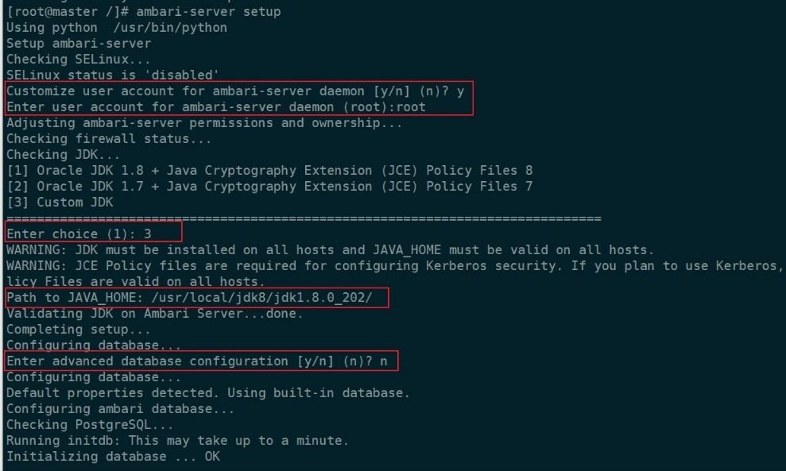
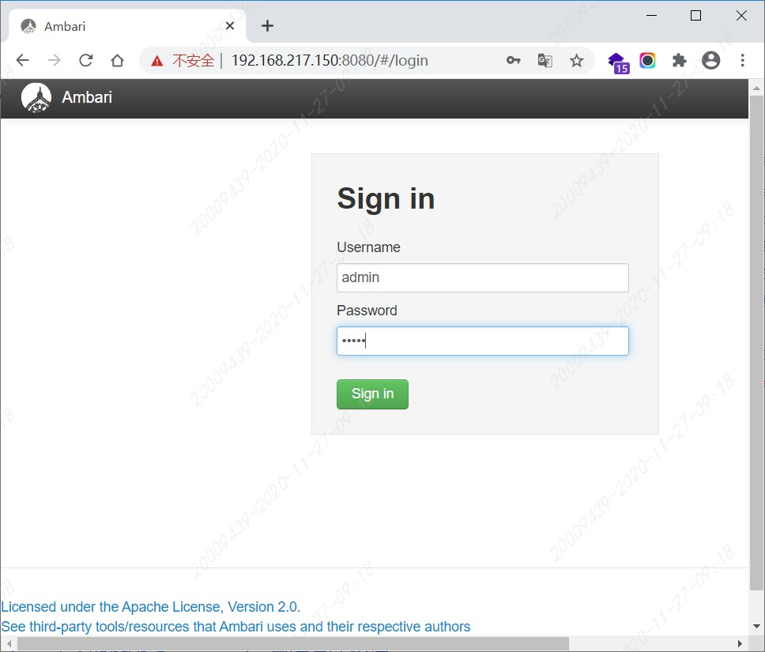
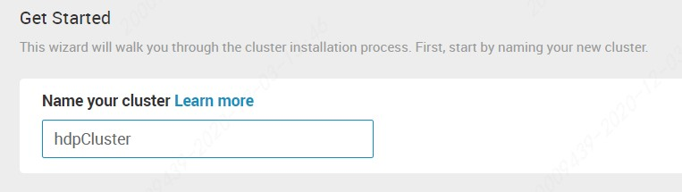
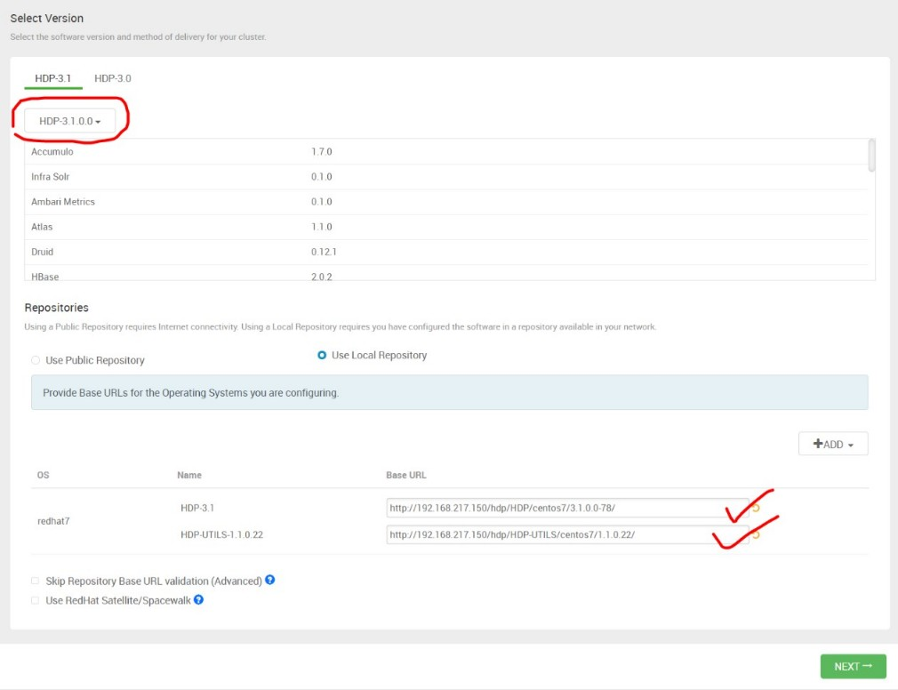
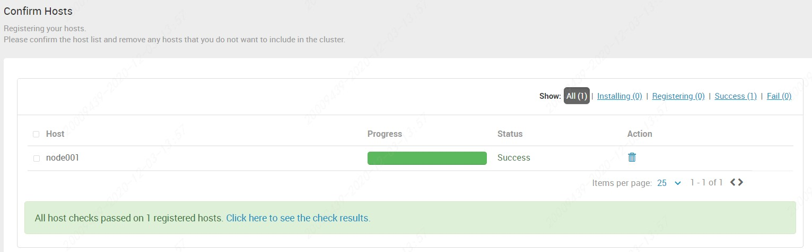

<!-- TOC -->

- [HDP](#hdp)
  - [Ambari离线安装](#ambari离线安装)
    - [下载拷贝](#下载拷贝)
    - [安装httpd](#安装httpd)
    - [创建本地源](#创建本地源)
    - [配置本地源](#配置本地源)
  - [ambari-server](#ambari-server)
    - [安装](#安装)
    - [启动配置](#启动配置)
  - [HDP集群](#hdp集群)
    - [创建集群](#创建集群)
    - [选择HDP版本](#选择hdp版本)
    - [确定TargetHost](#确定targethost)
    - [服务安装](#服务安装)

<!-- /TOC -->

<a id="markdown-hdp" name="hdp"></a>
# HDP

<a id="markdown-ambari离线安装" name="ambari离线安装"></a>
## Ambari离线安装

<a id="markdown-下载拷贝" name="下载拷贝"></a>
### 下载拷贝
下载 Ambari与HDP 官网 [Hortonworks](https://docs.cloudera.com/)

```
http://public-repo-1.hortonworks.com/ambari/centos7/2.x/updates/2.7.3.0/ambari-2.7.3.0-centos7.tar.gz
http://public-repo-1.hortonworks.com/HDP/centos7/3.x/updates/3.1.0.0/HDP-3.1.0.0-centos7-rpm.tar.gz
http://public-repo-1.hortonworks.com/HDP-UTILS-1.1.0.22/repos/centos7/HDP-UTILS-1.1.0.22-centos7.tar.gz
```

使用ftp将物理主机中已下载好的三个文件上传至master节点【/var/ftp/pub】路径下

<a id="markdown-安装httpd" name="安装httpd"></a>
### 安装httpd

```shell
[root@master ~]# yum install yum-utils createrepo yum-plugin-priorities -y
#添加 gpgcheck=0
[root@master ~]# vi /etc/yum/pluginconf.d/priorities.conf
```

```
[main]
enabled = 1
gpgcheck = 0
```

配置http服务

```shell
#检查是否安装httpd 
[root@master ~]# yum list httpd
#未安装则安装httpd
[root@master ~]# yum install -y httpd
#配置HTTP 服务到系统层使其随系统自动启动
[root@master ~]# chkconfig httpd on
[root@master ~]# service httpd start
```

测试访问`http://192.168.217.150/`，即默认端口80，通过浏览器访问页面如下：


web程序根目录：【/var/www/html】，可以测试将静态页面文件上传至此目录，并通过浏览器访问测试。

<a id="markdown-创建本地源" name="创建本地源"></a>
### 创建本地源

将下载的3个tar包解压到/var/www/html 相应目录下

```shell
[root@master ~]# cd /var/www/html/
[root@master html]# mkdir ambari
[root@master ambari]# cd ..
[root@master html]# mkdir hdp
```

将资源解压到指定位置：

```shell
[root@master pub]# cd /var/ftp/pub
[root@master pub]# ll
总用量 10844988
-rw------- 1 ftp ftp 1947685893 12月  3 09:11 ambari-2.7.3.0-centos7.tar.gz
-rw------- 1 ftp ftp 9066967592 12月  3 09:12 HDP-3.1.0.0-centos7-rpm.tar.gz
-rw------- 1 ftp ftp   90606616 12月  3 09:11 HDP-UTILS-1.1.0.22-centos7.tar.gz


[root@master pub]# tar -zxvf ambari-2.7.3.0-centos7.tar.gz -C /var/www/html/ambari
[root@master pub]# tar -zxvf HDP-3.1.0.0-centos7-rpm.tar.gz -C /var/www/html/hdp
[root@master pub]# tar -zxvf HDP-UTILS-1.1.0.22-centos7.tar.gz -C /var/www/html/hdp
```

createrepo

```shell
[root@master home]# cd /var/www/html/ambari/
[root@master ambari]# createrepo ./
```

```
Spawning worker 0 with 12 pkgs
Workers Finished
Saving Primary metadata
Saving file lists metadata
Saving other metadata
Generating sqlite DBs
Sqlite DBs complete
```

<a id="markdown-配置本地源" name="配置本地源"></a>
### 配置本地源

下载ambari.repo　HDP.repo，配置为本地源

```shell
[root@master ambari]# cd /etc/yum.repos.d/
[root@master yum.repos.d]# ll
总用量 40
-rw-r--r--  1 root root 1572 12月  1 2016 CentOS7-Base-163.repo
-rw-r--r--. 1 root root 1664 4月   8 2020 CentOS-Base.repo.backup
-rw-r--r--. 1 root root 1309 4月   8 2020 CentOS-CR.repo
-rw-r--r--. 1 root root  649 4月   8 2020 CentOS-Debuginfo.repo
-rw-r--r--. 1 root root  314 4月   8 2020 CentOS-fasttrack.repo
-rw-r--r--. 1 root root  630 4月   8 2020 CentOS-Media.repo
-rw-r--r--. 1 root root 1331 4月   8 2020 CentOS-Sources.repo
-rw-r--r--. 1 root root 7577 4月   8 2020 CentOS-Vault.repo
-rw-r--r--. 1 root root  616 4月   8 2020 CentOS-x86_64-kernel.repo
```

```shell
[root@master yum.repos.d]# wget -nv http://public-repo-1.hortonworks.com/ambari/centos7/2.x/updates/2.7.3.0/ambari.repo
[root@master yum.repos.d]# vi ambari.repo
```

修改配置`gpgcheck=0`，`baseurl`和`gpgkey`的配置，对应到master节点httpd应用的指定位置。

```
#VERSION_NUMBER=2.7.3.0-139
[ambari-2.7.3.0]
#json.url = http://public-repo-1.hortonworks.com/HDP/hdp_urlinfo.json
name=ambari Version - ambari-2.7.3.0
#baseurl=http://public-repo-1.hortonworks.com/ambari/centos7/2.x/updates/2.7.3.0
baseurl=http://192.168.217.150/ambari/ambari/centos7/2.7.3.0-139/
gpgcheck=0
#gpgkey=http://public-repo-1.hortonworks.com/ambari/centos7/2.x/updates/2.7.3.0/RPM-GPG-KEY/RPM-GPG-KEY-Jenkins
gpgkey=http://192.168.217.150/ambari/ambari/centos7/2.7.3.0-139/RPM-GPG-KEY/RPM-GPG-KEY-Jenkins
enabled=1
priority=1
```

配置HDP repo

```shell
[root@master yum.repos.d]# wget -nv http://public-repo-1.hortonworks.com/HDP/centos7/3.x/updates/3.1.0.0/hdp.repo
[root@master yum.repos.d]# vi hdp.repo
```

同样的，修改配置`gpgcheck=0`，`baseurl`和`gpgkey`的配置，对应到master节点httpd应用的指定位置。

```
#VERSION_NUMBER=3.1.0.0-78
[HDP-3.1.0.0]
name=HDP Version - HDP-3.1.0.0
#baseurl=http://public-repo-1.hortonworks.com/HDP/centos7/3.x/updates/3.1.0.0
baseurl=http://192.168.217.150/hdp/HDP/centos7/3.1.0.0-78/
gpgcheck=0
#gpgkey=http://public-repo-1.hortonworks.com/HDP/centos7/3.x/updates/3.1.0.0/RPM-GPG-KEY/RPM-GPG-KEY-Jenkins
gpgkey=http://192.168.217.150/hdp/HDP/centos7/3.1.0.0-78/RPM-GPG-KEY/RPM-GPG-KEY-Jenkins
enabled=1
priority=1


[HDP-UTILS-1.1.0.22]
name=HDP-UTILS Version - HDP-UTILS-1.1.0.22
#baseurl=http://public-repo-1.hortonworks.com/HDP-UTILS-1.1.0.22/repos/centos7
baseurl=http://192.168.217.150/hdp/HDP-UTILS/centos7/1.1.0.22/
gpgcheck=0
#gpgkey=http://public-repo-1.hortonworks.com/HDP/centos7/3.x/updates/3.1.0.0/RPM-GPG-KEY/RPM-GPG-KEY-Jenkins
gpgkey=http://192.168.217.150/hdp/HDP-UTILS/centos7/1.1.0.22/RPM-GPG-KEY/RPM-GPG-KEY-Jenkins
enabled=1
priority=1
```

执行命令更新yum源

```shell
[root@master yum.repos.d]# yum clean all
[root@master yum.repos.d]# yum makecache
```

检查仓库是否可用

```shell
[root@master yum.repos.d]# yum repolist
```

在repolist中检查是否有

- `ambari-2.7.3.0`
- `HDP-3.1.0.0`
- `HDP-UTILS-1.1.0.22`

将`ambari.repo`和`hdp.repo`两个文件拷贝至cluster节点【/etc/yum.repos.d/】目录内，

```shell
yum clean all
yum makecache
```

<a id="markdown-ambari-server" name="ambari-server"></a>
## ambari-server

<a id="markdown-安装" name="安装"></a>
### 安装

```shell
# 安装ambari-server
[root@master ~]# yum install -y ambari-server
```

配置ambari-server：

```shell
ambari-server setup
```

注意下图中红框标注的输入项：



注意：Ambari默认使用postgreSQL

```shell
# 需要提前准备mysql驱动
yum install -y mysql-connector-java
# 检查安装是否成功
ls -al /usr/share/java/mysql-connector-java.jar
cd /var/lib/ambari-server/resources/
# 创建链接
ln -s /usr/share/java/mysql-connector-java.jar mysql-connector-java.jar
```

<a id="markdown-启动配置" name="启动配置"></a>
### 启动配置

查看并启动`Ambari-server`

```shell
[root@master /]# service ambari-server start
```

```
Using python  /usr/bin/python
Starting ambari-server
Ambari Server running with administrator privileges.
Organizing resource files at /var/lib/ambari-server/resources...
Ambari database consistency check started...
Server PID at: /var/run/ambari-server/ambari-server.pid
Server out at: /var/log/ambari-server/ambari-server.out
Server log at: /var/log/ambari-server/ambari-server.log
Waiting for server start.................................
Server started listening on 8080

DB configs consistency check: no errors and warnings were found.
Ambari Server 'start' completed successfully.
```

登陆Ambari 默认用户名/密码：admin/admin 地址：http://192.168.217.150:8080



主界面：


<a id="markdown-hdp集群" name="hdp集群"></a>
## HDP集群

<a id="markdown-创建集群" name="创建集群"></a>
### 创建集群



集群名称：`hdpCluster`

<a id="markdown-选择hdp版本" name="选择hdp版本"></a>
### 选择HDP版本

选择对应 HDP 版本，选择本地库安装，多余的os项可以移除掉：



<a id="markdown-确定targethost" name="确定targethost"></a>
### 确定TargetHost
配置子节点，并上传master私钥


注意如果不是在master本机上访问ambari-server直接浏览是找不到密钥的

需要将master节点上【~/.ssh/id_rsa】下载到本地，再上传至ambari-server

正在确认注册中。。。


主机确认成功！



<a id="markdown-服务安装" name="服务安装"></a>
### 服务安装

开始安装服务

这里我们选择Hive+HBase+Zookeeper+Storm，并依据提示选择其他必备组件


后续过程默认设置即可。


---

参考引用：

[ambari介绍及安装](https://www.cnblogs.com/xuliang666/p/11381225.html)

[兼容性检查](https://supportmatrix.hortonworks.com/)

[ambari2.7.3离线安装](https://www.jianshu.com/p/25df5ab42110)

[hive-clinet install error mysql-connector-java](https://community.cloudera.com/t5/Support-Questions/Cannot-install-Hive-clients/m-p/228135#M189995)