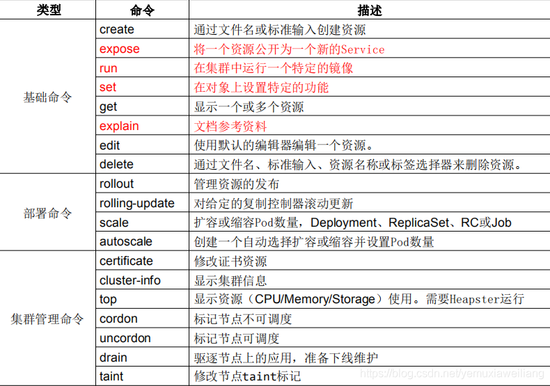
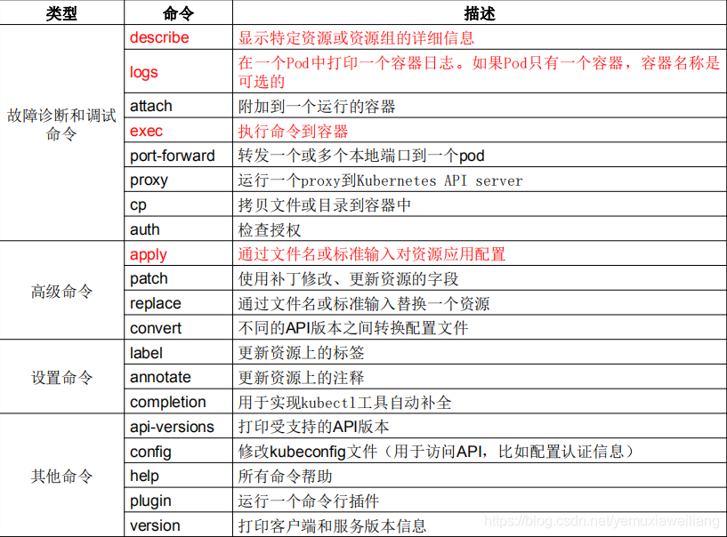

<!-- TOC -->

- [K8S](#k8s)
  - [概述](#概述)
  - [环境基础配置（所有节点）](#环境基础配置所有节点)
    - [关闭防火墙](#关闭防火墙)
    - [关闭selinux](#关闭selinux)
    - [关闭swap](#关闭swap)
    - [修改主机名称](#修改主机名称)
    - [添加主机名与IP对应关系(记得设置主机名)](#添加主机名与ip对应关系记得设置主机名)
    - [将桥接的IPv4流量传递到iptables的链](#将桥接的ipv4流量传递到iptables的链)
  - [kubeadm、kubelet、kubectl安装配置](#kubeadmkubeletkubectl安装配置)
    - [安装 kubeadm、kubelet、kubectl](#安装-kubeadmkubeletkubectl)
    - [kubeadm 配置(仅在 master 节点执行)](#kubeadm-配置仅在-master-节点执行)
    - [kubectl节点](#kubectl节点)
    - [安装Pod网络插件（CNI）](#安装pod网络插件cni)
    - [查看pod状态](#查看pod状态)
  - [deployment 测试](#deployment-测试)
  - [安装 Kubernetes-Dashboard](#安装-kubernetes-dashboard)
  - [kubectl](#kubectl)
    - [kubectl命令](#kubectl命令)

<!-- /TOC -->

<a id="markdown-k8s" name="k8s"></a>
# K8S

<a id="markdown-概述" name="概述"></a>
## 概述

Pod 是一组容器（可包含一个或多个应用程序容器），以及共享存储（卷 Volumes）、IP 地址和有关如何运行容器的信息。

Pod（容器组）总是在 Node（节点） 上运行。Node（节点）是 kubernetes 集群中的计算机，可以是虚拟机或物理机。每个 Node（节点）都由 master 管理。

Node、Deployment、Pod、Service

kubectl：是 Kubernetes 的命令行工具，人们通常通过它与 Kubernetes 进行交互。

Kubelet：是 kubernetes 工作节点上的一个代理组件，运行在每个节点上。

Kubeadm：是一个提供了 kubeadm init 和 kubeadm join 的工具， 作为创建 Kubernetes 集群的"快捷途径" 的最佳实践（用于创建集群）。


<a id="markdown-环境基础配置所有节点" name="环境基础配置所有节点"></a>
## 环境基础配置（所有节点）


<a id="markdown-关闭防火墙" name="关闭防火墙"></a>
### 关闭防火墙

```shell
systemctl stop firewalld
systemctl disable firewalld
```

<a id="markdown-关闭selinux" name="关闭selinux"></a>
### 关闭selinux

```shell
sed -i 's/enforcing/disabled/' /etc/selinux/config 
setenforce 0
```

<a id="markdown-关闭swap" name="关闭swap"></a>
### 关闭swap

```shell
# 临时关闭
swapoff -a

# 注释到swap那一行  永久关闭
sed -ri 's/.*swap.*/#&/' /etc/fstab

```

<a id="markdown-修改主机名称" name="修改主机名称"></a>
### 修改主机名称

vmware克隆主机，注意需要重新生成新的 mac 地址

```shell
hostnamectl set-hostname node01
hostname node01

hostnamectl set-hostname node02
hostname node02

hostnamectl set-hostname node03
hostname node03

# 同步修改ip
vi /etc/sysconfig/network-scripts/ifcfg-ens33
```

<a id="markdown-添加主机名与ip对应关系记得设置主机名" name="添加主机名与ip对应关系记得设置主机名"></a>
### 添加主机名与IP对应关系(记得设置主机名)

```shell
cat /etc/hosts
192.168.217.150 master
192.168.217.151 node01
192.168.217.152 node02
192.168.217.153 node03
```

<a id="markdown-将桥接的ipv4流量传递到iptables的链" name="将桥接的ipv4流量传递到iptables的链"></a>
### 将桥接的IPv4流量传递到iptables的链

```shell
cat > /etc/sysctl.d/k8s.conf << EOF
net.bridge.bridge-nf-call-ip6tables = 1
net.bridge.bridge-nf-call-iptables = 1
EOF

sysctl --system

```

<a id="markdown-kubeadmkubeletkubectl安装配置" name="kubeadmkubeletkubectl安装配置"></a>
## kubeadm、kubelet、kubectl安装配置

<a id="markdown-安装-kubeadmkubeletkubectl" name="安装-kubeadmkubeletkubectl"></a>
### 安装 kubeadm、kubelet、kubectl


查看所有版本列表，选择对应版本安装，需要确保 kubeadm、kubelet、kubectl 版本保持一致

```shell
# 查看版本列表
yum list kubeadm --showduplicates |sort
```


所有节点执行进行安装

```shell
cat > /etc/yum.repos.d/kubernetes.repo << EOF
[kubernetes]
name=Kubernetes
baseurl=https://mirrors.aliyun.com/kubernetes/yum/repos/kubernetes-el7-x86_64/
enabled=1
gpgcheck=0
gpgkey=https://mirrors.aliyun.com/kubernetes/yum/doc/yum-key.gpg
EOF


yum install -y kubelet-1.17.0-0 kubeadm-1.17.0-0 kubectl-1.17.0-0

# 启动
systemctl start kubelet
# 开启启动
systemctl enable kubelet
```


<a id="markdown-kubeadm-配置仅在-master-节点执行" name="kubeadm-配置仅在-master-节点执行"></a>
### kubeadm 配置(仅在 master 节点执行)

```shell
kubeadm init \
--apiserver-advertise-address=192.168.217.150 \
--image-repository registry.aliyuncs.com/google_containers \
--kubernetes-version v1.17.0 \
--service-cidr=10.1.0.0/16 \
--pod-network-cidr=10.244.0.0/16

```

出现问题：

```shell
[ERROR FileContent--proc-sys-net-ipv4-ip_forward]: /proc/sys/net/ipv4/ip_forward contents are not set to 1
```

开启IP转发 【/proc/sys/net/ipv4/ip_forward】 这个文件表示是否打开IP转发

```shell
# 开启转发
echo "1" > /proc/sys/net/ipv4/ip_forward

# 重启网络
service network restart

```


初始化完成后显示如下：

```shell
Your Kubernetes control-plane has initialized successfully!

To start using your cluster, you need to run the following as a regular user:

  mkdir -p $HOME/.kube
  sudo cp -i /etc/kubernetes/admin.conf $HOME/.kube/config
  sudo chown $(id -u):$(id -g) $HOME/.kube/config

You should now deploy a pod network to the cluster.
Run "kubectl apply -f [podnetwork].yaml" with one of the options listed at:
  https://kubernetes.io/docs/concepts/cluster-administration/addons/

Then you can join any number of worker nodes by running the following on each as root:

kubeadm join 192.168.217.150:6443 --token jj1lvv.mmizzjded4jpn7yr \
    --discovery-token-ca-cert-hash sha256:f09932dfbfc0537c832d178d99f90a3e1f9549a65df25a61fe2de898e23696a6 
```

默认token的有效期为24小时，当过期之后，该token就不可用了，

如果后续有nodes节点加入，重新生成新的token，解决方法如下：

```shell
kubeadm token list

kubeadm token create

```

获取ca证书sha256编码hash值

```shell
openssl x509 -pubkey -in /etc/kubernetes/pki/ca.crt | openssl rsa -pubin -outform der 2>/dev/null | openssl dgst -sha256 -hex | sed 's/^.* //'
```

<a id="markdown-kubectl节点" name="kubectl节点"></a>
### kubectl节点

每个节点都要执行，配置kubectl工具：

```shell
mkdir -p $HOME/.kube
cp -i /etc/kubernetes/admin.conf $HOME/.kube/config
chown $(id -u):$(id -g) $HOME/.kube/config
```

node节点没有 【admin.conf】配置文件，需要从master节点拷贝

```shell
scp admin.conf root@node01:/etc/kubernetes
scp admin.conf root@node02:/etc/kubernetes
scp admin.conf root@node03:/etc/kubernetes

mkdir -p $HOME/.kube
cp -i /etc/kubernetes/admin.conf $HOME/.kube/config
chown $(id -u):$(id -g) $HOME/.kube/config
```

使用前面配置 kubeadm 生产的token和hash值注册节点

```shell
kubeadm join 192.168.217.150:6443 --token i6405s.ql72cw734sbwrtnn \
    --discovery-token-ca-cert-hash sha256:5297c16a30f77e6d1c9a964350a1070c23ee17b3f431dadbbcfc4fb637938d59 
```


<a id="markdown-安装pod网络插件cni" name="安装pod网络插件cni"></a>
### 安装Pod网络插件（CNI）

需要注意一点官网给定的 【kube-flannel.yml】 配置文件对于 kubernetes 有最低版本要求

```shell
kubectl apply -f https://raw.githubusercontent.com/coreos/flannel/master/Documentation/kube-flannel.yml
```

如果下载不了，也可以选择本地配置

```shell
echo '' >> /root/kube-flannel.yml

# 将配置内容复制进去
vi /root/kube-flannel.yml

kubectl apply -f /root/kube-flannel.yml

# 查看集群节点信息
kubectl get node
```

查看

```shell
kubectl -n kube-system get pods -o wide
```


查看日志：

```shell
journalctl -f -u kubelet.service
```

<a id="markdown-查看pod状态" name="查看pod状态"></a>
### 查看pod状态

```shell
# 查看集群节点信息
kubectl get node

[root@master ~]# kubectl get node
NAME     STATUS   ROLES    AGE   VERSION
master   Ready    master   16m   v1.17.0
node01   Ready    <none>   12m   v1.17.0
node02   Ready    <none>   12m   v1.17.0
node03   Ready    <none>   12m   v1.17.0

```

<a id="markdown-deployment-测试" name="deployment-测试"></a>
## deployment 测试

```shell

[root@master ~]# kubectl create deployment nginx --image=nginx
deployment.apps/nginx created

[root@master ~]# kubectl expose deployment nginx --port=80 --type=NodePort
service/nginx exposed

# 正在创建
[root@master ~]# kubectl get pods,svc
NAME                         READY   STATUS              RESTARTS   AGE
pod/nginx-86c57db685-6cmg4   0/1     ContainerCreating   0          41s

NAME                 TYPE        CLUSTER-IP   EXTERNAL-IP   PORT(S)        AGE
service/kubernetes   ClusterIP   10.1.0.1     <none>        443/TCP        13m
service/nginx        NodePort    10.1.40.0    <none>        80:31121/TCP   6s

# 创建完成
[root@master ~]# kubectl get pods,svc
NAME                         READY   STATUS    RESTARTS   AGE
pod/nginx-86c57db685-6cmg4   1/1     Running   0          108s

NAME                 TYPE        CLUSTER-IP   EXTERNAL-IP   PORT(S)        AGE
service/kubernetes   ClusterIP   10.1.0.1     <none>        443/TCP        14m
service/nginx        NodePort    10.1.40.0    <none>        80:31121/TCP   73s
```

访问 http://192.168.217.150:31121

<a id="markdown-安装-kubernetes-dashboard" name="安装-kubernetes-dashboard"></a>
## 安装 Kubernetes-Dashboard

Kubernetes-Dashboard 是一个 管理 Kubernetes 集群的 Web UI，跟 kubectl 一样，其后端是 API-Server，使用在线的 YAML 文件部署 Kubernetes-Dashboard ：

```bash
kubectl apply -f https://raw.githubusercontent.com/kubernetes/dashboard/v2.2.0/aio/deploy/recommended.yaml

kubectl get pods --namespace=kubernetes-dashboard

kubectl get services --namespace=kubernetes-dashboard
```

由于其网络默认是 NodePort 的方式，没有配置外界打开，所以为了能够被外界访问，可以修改其 service：

```bash
kubectl edit service kubernetes-dashboard --namespace=kubernetes-dashboard
```

```bash
  ports:
  - nodePort: 30633 # 新增此行
    port: 443
    protocol: TCP
    targetPort: 8443
  selector:
    k8s-app: kubernetes-dashboard
  sessionAffinity: None
  type: NodePort # 修改此行

```

在集群内网可以通过 443 访问，在外网可以通过 30633 访问，访问方式是 https。

通过下面这条命令我们可以查看 Token：

```bash
kubectl -n kube-system describe $(kubectl -n kube-system get secret -n kube-system -o name | grep namespace) | grep token
```


<a id="markdown-kubectl" name="kubectl"></a>
## kubectl

<a id="markdown-kubectl命令" name="kubectl命令"></a>
### kubectl命令






```shell
# 部署应用
kubectl apply -f app.yaml

# 查看所有命名空间 pod
kubectl get pods -A

# 查看 pod 包含所有附加信息
kubectl get pod -o wide

# 过滤掉系统的命名空间 pod
kubectl get pod -A |grep -v kube-system

# 过滤掉系统命名空间的pod 节点信息
kubectl get pod -A -o yaml |grep '^    n'|grep -v nodeSelector|sed 'N;N;s/\n/ /g'|grep -v kube-system

# 查看 pod 名称
kubectl describe pod pod-name

# 查看 svc 详情
kubectl describe svc svc-name

# 重新创建 pod
kubectl get pod pod名称 -n 命名空间名称 -o yaml | kubectl replace --force -f -

# 重新部署 deployment
kubectl rollout restart deployment -n your-namespace xxx-deployment

# 查看 log
kubectl logs pod-name

# 进入 Pod 容器终端， -c container-name 可以指定进入哪个容器。
kubectl exec -it pod-name -- bash

# 伸缩扩展副本
kubectl scale deployment deploy-name --replicas=5

# 把集群内端口映射到节点
kubectl port-forward pod-name 8090:8080

# 查看历史
kubectl rollout history deployment deploy-name

# 回到上个版本
kubectl rollout undo deployment deploy-name

# 回到指定版本
kubectl rollout undo deployment deploy-name --to-revision=2

# 删除部署
kubectl delete deployment deploy-name

# 导出yaml配置到文件
kubectl get deployment deploy-name -o yaml > file-name.yaml

# 指定端口暴露服务
kubectl expose deployment nginx --port=80 --target-port=8000

```


---

参考引用：

[使用 kubeadm 创建集群](https://kubernetes.io/zh-cn/docs/setup/production-environment/tools/kubeadm/create-cluster-kubeadm/)

[对 kubeadm 进行故障排查](https://kubernetes.io/zh-cn/docs/setup/production-environment/tools/kubeadm/troubleshooting-kubeadm/)

[Kubernetes教程](https://k8s.easydoc.net/docs/dRiQjyTY/28366845/6GiNOzyZ/9EX8Cp45)

[minikube start](https://minikube.sigs.k8s.io/docs/start/)

[Kuboard-Kubernetes教程](https://kuboard.cn/learning/)


