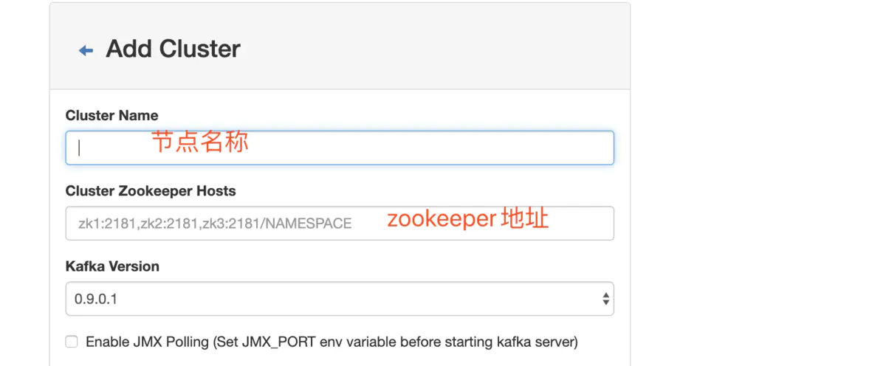

<!-- TOC -->

- [Kafka](#kafka)
  - [概述](#概述)
  - [基础环境](#基础环境)
    - [zookeeper](#zookeeper)
    - [zookeeper-web](#zookeeper-web)
    - [kafka](#kafka-1)
    - [kafka-manager](#kafka-manager)

<!-- /TOC -->

<a id="markdown-kafka" name="kafka"></a>
# Kafka

<a id="markdown-概述" name="概述"></a>
## 概述

一个kafka架构包括若干个Producer（服务器日志、业务数据、web前端产生的page view等）

若干个Broker（kafka支持水平扩展，一般broker数量越多集群的吞吐量越大）

若干个consumer group

一个Zookeeper集群（kafka通过Zookeeper管理集群配置、选举leader、consumer group发生变化时进行rebalance）


ip-port | docker images | 说明
---------|----------|---------
192.168.217.150:2181 | zookeeper | 注册中心
192.168.217.150:18080 | tobilg/zookeeper-webui | zookeeper ui 界面
192.168.217.150:19000 | sheepkiller/kafka-manager | kafka-manager web管理界面
192.168.217.151:9092 | bitnami/kafka | kafka集群节点
192.168.217.151:9093 | bitnami/kafka | kafka集群节点


<a id="markdown-基础环境" name="基础环境"></a>
## 基础环境

<a id="markdown-zookeeper" name="zookeeper"></a>
### zookeeper

```shell
docker pull zookeeper

docker run --name zoo \
  -p 2181:2181 \
  -d zookeeper
```

检查运行状态：

```shell
# 进入容器
[root@master ~]# docker exec -it zoo /bin/bash
# 进入zookeeper目录
root@d8c864c3a0ee:/apache-zookeeper-3.7.0-bin# cd /apache-zookeeper-3.7.0-bin/bin
# 查询状态
root@d8c864c3a0ee:/apache-zookeeper-3.7.0-bin/bin# ./zkServer.sh status
ZooKeeper JMX enabled by default
Using config: /conf/zoo.cfg
Client port found: 2181. Client address: localhost. Client SSL: false.
Mode: standalone
```

其他命令：
```shell
./zkServer.sh start
./zkServer.sh stop
./zkServer.sh status
```

<a id="markdown-zookeeper-web" name="zookeeper-web"></a>
### zookeeper-web

```shell
docker pull tobilg/zookeeper-webui

docker run --name zk-web \
  -p 18080:8080 \
  -e ZK_DEFAULT_NODE=192.168.217.150:2181/ \
  -e USER=admin \
  -e PASSWORD=admin \
  -d tobilg/zookeeper-webui
```

访问： http://192.168.217.150:18080/node


<a id="markdown-kafka" name="kafka"></a>
### kafka

```shell
docker pull bitnami/kafka

# 集群节点1
docker run --name kafka01 \
  -p 9092:9092 \
  -e KAFKA_ZOOKEEPER_CONNECT=192.168.217.150:2181 \
  -e ALLOW_PLAINTEXT_LISTENER=yes \
  -e KAFKA_ADVERTISED_LISTENERS=PLAINTEXT://localhost:9092 \
  -e KAFKA_LISTENERS=PLAINTEXT://0.0.0.0:9092 \
  -d bitnami/kafka

```

检查运行状态：
```shell
# 进入容器
docker exec -it kafka01 bash

cd /opt/bitnami/kafka/bin
./kafka-console-producer.sh --broker-list localhost:9092 --topic test
> hello wang
> halo halo

# 显示接收的消息
./kafka-console-consumer.sh --bootstrap-server localhost:9092 --topic test --from-beginning

```

创建kafka集群的第2个节点：

```shell
  # 集群节点2
docker run --name kafka02 \
  -p 9093:9093 \
  -e KAFKA_ZOOKEEPER_CONNECT=192.168.217.150:2181 \
  -e ALLOW_PLAINTEXT_LISTENER=yes \
  -e KAFKA_ADVERTISED_LISTENERS=PLAINTEXT://localhost:9093 \
  -e KAFKA_LISTENERS=PLAINTEXT://0.0.0.0:9093 \
  -d bitnami/kafka
```

同步修改 【kafka02:/opt/bitnami/kafka/config/zookeeper.properties】中的端口号

```
listeners=PLAINTEXT://0.0.0.0:9093

advertised.listeners=PLAINTEXT://localhost:9093
```

<a id="markdown-kafka-manager" name="kafka-manager"></a>
### kafka-manager

```shell
# 拉取镜像
docker pull sheepkiller/kafka-manager

# 创建容器
docker run --name kfk-manager \
  -p 19000:9000 \
  -e ZK_HOSTS=192.168.217.150:2181 \
  -d sheepkiller/kafka-manager
```

访问 http://192.168.217.150:19000/ ，并添加 zookeeper 节点配置




---

参考引用：

[大白话 kafka 架构原理](https://mp.weixin.qq.com/s?__biz=MzU1NDA0MDQ3MA==&mid=2247483958&idx=1&sn=dffaad318b50f875eea615bc3bdcc80c&chksm=fbe8efcfcc9f66d9ff096fbae1c2a3671f60ca4dc3e7412ebb511252e7193a46dcd4eb11aadc&scene=21#wechat_redirect)

[秒懂 kafka HA（高可用）](https://mp.weixin.qq.com/s?__biz=MzU1NDA0MDQ3MA==&mid=2247483965&idx=1&sn=20dd02c4bf3a11ff177906f0527a5053&chksm=fbe8efc4cc9f66d258c239fefe73125111a351d3a4e857fd8cd3c98a5de2c18ad33aacdad947&scene=21#wechat_redirect)

[SpringBoot集成kafka全面实战](https://blog.csdn.net/yuanlong122716/article/details/105160545)


