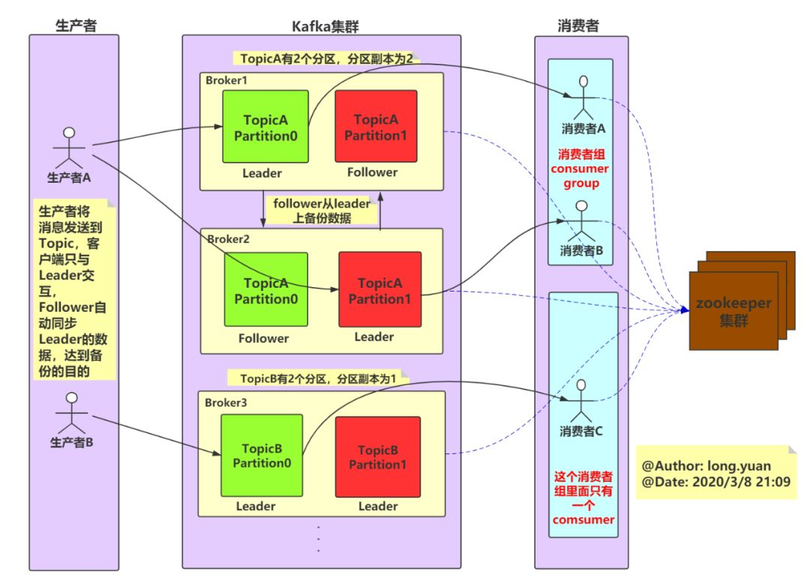

<!-- TOC -->

- [Kafka](#kafka)
  - [概述](#概述)
  - [基础环境](#基础环境)
    - [zookeeper](#zookeeper)
    - [zookeeper-web](#zookeeper-web)
    - [kafka](#kafka-1)
    - [kafka-manager](#kafka-manager)
  - [Kafka架构](#kafka架构)
    - [生产消费](#生产消费)
    - [单播多播](#单播多播)
    - [主题和分区](#主题和分区)
    - [分区消费组消费者消费](#分区消费组消费者消费)
  - [SpringBoot集成](#springboot集成)
    - [server配置确认](#server配置确认)
    - [pom和config](#pom和config)
    - [生产和消费](#生产和消费)
    - [带回调的生产](#带回调的生产)

<!-- /TOC -->

<a id="markdown-kafka" name="kafka"></a>
# Kafka

<a id="markdown-概述" name="概述"></a>
## 概述

一个kafka架构包括若干个Producer（服务器日志、业务数据、web前端产生的page view等）

若干个Broker（kafka支持水平扩展，一般broker数量越多集群的吞吐量越大）

若干个consumer group

一个Zookeeper集群（kafka通过Zookeeper管理集群配置、选举leader、consumer group发生变化时进行rebalance）


ip-port | docker images | 说明
---------|----------|---------
192.168.217.150:2181 | zookeeper | 注册中心
192.168.217.150:18080 | tobilg/zookeeper-webui | zookeeper ui 界面
192.168.217.150:19000 | sheepkiller/kafka-manager | kafka-manager web管理界面
192.168.217.151:9092 | bitnami/kafka | kafka集群节点
192.168.217.151:9093 | bitnami/kafka | kafka集群节点


<a id="markdown-基础环境" name="基础环境"></a>
## 基础环境

<a id="markdown-zookeeper" name="zookeeper"></a>
### zookeeper

```shell
docker pull zookeeper

docker run --name zoo \
  -p 2181:2181 \
  -d zookeeper
```

检查运行状态：

```shell
# 进入容器
[root@master ~]# docker exec -it zoo /bin/bash
# 进入zookeeper目录
root@d8c864c3a0ee:/apache-zookeeper-3.7.0-bin# cd /apache-zookeeper-3.7.0-bin/bin
# 查询状态
root@d8c864c3a0ee:/apache-zookeeper-3.7.0-bin/bin# ./zkServer.sh status
ZooKeeper JMX enabled by default
Using config: /conf/zoo.cfg
Client port found: 2181. Client address: localhost. Client SSL: false.
Mode: standalone
```

其他命令：
```shell
./zkServer.sh start
./zkServer.sh stop
./zkServer.sh status
```

<a id="markdown-zookeeper-web" name="zookeeper-web"></a>
### zookeeper-web

```shell
docker pull tobilg/zookeeper-webui

docker run --name zk-web \
  -p 18080:8080 \
  -e ZK_DEFAULT_NODE=192.168.217.150:2181/ \
  -e USER=admin \
  -e PASSWORD=admin \
  -d tobilg/zookeeper-webui
```

访问： http://192.168.217.150:18080/node


<a id="markdown-kafka" name="kafka"></a>
### kafka

```shell
docker pull bitnami/kafka

# 集群节点1
docker run --name kafka01 \
  -p 9092:9092 \
  -e KAFKA_BROKER_ID=1 \
  -e KAFKA_ZOOKEEPER_CONNECT=192.168.217.150:2181 \
  -e ALLOW_PLAINTEXT_LISTENER=yes \
  -e KAFKA_ADVERTISED_LISTENERS=PLAINTEXT://192.168.217.151:9092 \
  -e KAFKA_LISTENERS=PLAINTEXT://0.0.0.0:9092 \
  -d bitnami/kafka

```

检查运行状态：
```shell
# 进入容器
docker exec -it kafka01 bash

cd /opt/bitnami/kafka/bin
./kafka-console-producer.sh --broker-list localhost:9092 --topic kfk1
> hello wang
> halo halo

# 显示接收的消息
./kafka-console-consumer.sh --bootstrap-server localhost:9092 --topic kfk1 --from-beginning

```

创建kafka集群的第2个节点：

```shell
  # 集群节点2
docker run --name kafka02 \
  -p 9093:9093 \
  -e KAFKA_BROKER_ID=2 \
  -e KAFKA_ZOOKEEPER_CONNECT=192.168.217.150:2181 \
  -e ALLOW_PLAINTEXT_LISTENER=yes \
  -e KAFKA_ADVERTISED_LISTENERS=PLAINTEXT://192.168.217.151:9093 \
  -e KAFKA_LISTENERS=PLAINTEXT://0.0.0.0:9093 \
  -d bitnami/kafka
```

同步修改 【kafka02:/opt/bitnami/kafka/config/zookeeper.properties】中的端口号

```
listeners=PLAINTEXT://0.0.0.0:9093

advertised.listeners=PLAINTEXT://192.168.217.151:9093
```

<a id="markdown-kafka-manager" name="kafka-manager"></a>
### kafka-manager

```shell
# 拉取镜像
docker pull sheepkiller/kafka-manager

# 创建容器
docker run --name kfk-manager \
  -p 19000:9000 \
  -e ZK_HOSTS=192.168.217.150:2181 \
  -d sheepkiller/kafka-manager
```

访问 http://192.168.217.150:19000/ ，并添加 zookeeper 节点配置


<a id="markdown-kafka架构" name="kafka架构"></a>
## Kafka架构




<a id="markdown-生产消费" name="生产消费"></a>
### 生产消费

```shell
cd /opt/bitnami/kafka/bin

# 发消息
./kafka-console-producer.sh --broker-list 192.168.217.151:9092 --topic topic_kfk1

# 消息消费，从头开始 --from-beginning
./kafka-console-consumer.sh --bootstrap-server 192.168.217.151:9092 --topic topic_kfk1 --from-beginning
# 消息偏移消费，从最新开始
./kafka-console-consumer.sh --bootstrap-server 192.168.217.151:9092 --topic topic_kfk1

```

<a id="markdown-单播多播" name="单播多播"></a>
### 单播多播

```shell
cd /opt/bitnami/kafka/bin

# 发消息
./kafka-console-producer.sh --broker-list 192.168.217.151:9092 --topic topic_kfk1

# 单播消费者1
./kafka-console-consumer.sh --bootstrap-server 192.168.217.151:9092 --consumer-property group.id=group1 --topic topic_kfk1
# 单播消费者2
./kafka-console-consumer.sh --bootstrap-server 192.168.217.151:9092 --consumer-property group.id=group1 --topic topic_kfk1
# 多播消费者 消费组不一样
./kafka-console-consumer.sh --bootstrap-server 192.168.217.151:9092 --consumer-property group.id=group2 --topic topic_kfk1


```

单播模式下，同一个topic同一个消费组group下单一消费（rebalance），只有一个消费者可收到。

```shell

# 消费者有哪些消费组
./kafka-consumer-groups.sh --bootstrap-server 192.168.217.151:9092 --list

./kafka-consumer-groups.sh --bootstrap-server 192.168.217.151:9092 --describe --all-groups

./kafka-consumer-groups.sh --bootstrap-server 192.168.217.151:9092 --describe --group group1
```

<a id="markdown-主题和分区" name="主题和分区"></a>
### 主题和分区

主题Topic是逻辑概念，将消息进行分类。

通过partition将一个topic中的消息分区存储，优势：

- 避免单一文件过大
- 提升读写吞吐量，读写在多个分区可以同时

kafka内部创建 `__consumer_offsets` 默认50个分区，用于存放消费者消费某主题的偏移量。

消费者消费时候，上报当前 `offset` 偏移量至默认主题 `__consumer_offesets`。

<a id="markdown-分区消费组消费者消费" name="分区消费组消费者消费"></a>
### 分区消费组消费者消费

一个partition只能被一个消费组里的某一个消费者消费，从而保证消费者顺序。

一个消费者是可以消费多个partition的。

kafka只保证同一partition范围内的局部顺序性，不能在同topic不同partition保证顺序性。


<a id="markdown-springboot集成" name="springboot集成"></a>
## SpringBoot集成

<a id="markdown-server配置确认" name="server配置确认"></a>
### server配置确认

确认kafka配置【/opt/bitnami/kafka/config/server.properties】，该配置文件修改无效，在创建容器时做调整：

```bash
advertised.listeners=PLAINTEXT://192.168.217.151:9092
```

```bash
advertised.listeners=PLAINTEXT://192.168.217.151:9093
```

<a id="markdown-pom和config" name="pom和config"></a>
### pom和config

springboot项目添加pom

```xml
<dependency>
    <groupId>org.springframework.kafka</groupId>
    <artifactId>spring-kafka</artifactId>
</dependency>
```

添加配置文件【application.properties】

```properties
###########【Kafka集群】###########
spring.kafka.bootstrap-servers=192.168.217.151:9092,192.168.217.151:9093
###########【初始化生产者配置】###########
# 重试次数
spring.kafka.producer.retries=0
# 应答级别:多少个分区副本备份完成时向生产者发送ack确认(可选0、1、all/-1)
spring.kafka.producer.acks=1
# 生产端缓冲区大小 32Mb 存放发送的消息
spring.kafka.producer.buffer-memory = 33554432
# 批量大小 本地线程从缓冲区每次拉取 16Kb 数据发送
spring.kafka.producer.batch-size=16384
# 提交延时 如果数据不满 batch-size 则指定时间后也发送
spring.kafka.producer.properties.linger.ms=10
# 当生产端积累的消息达到batch-size或接收到消息linger.ms后,生产者就会将消息提交给kafka
# linger.ms为0表示每接收到一条消息就提交给kafka,这时候batch-size其实就没用了


# Kafka提供的序列化和反序列化类
spring.kafka.producer.key-serializer=org.apache.kafka.common.serialization.StringSerializer
spring.kafka.producer.value-serializer=org.apache.kafka.common.serialization.StringSerializer
# 自定义分区器
# spring.kafka.producer.properties.partitioner.class=com.felix.kafka.producer.CustomizePartitioner

###########【初始化消费者配置】###########
# 默认的消费组ID
spring.kafka.consumer.properties.group.id=defaultConsumerGroup
# 是否自动提交offset
spring.kafka.consumer.enable-auto-commit=true
# 提交offset延时(接收到消息后多久提交offset)
spring.kafka.consumer.auto.commit.interval.ms=1000
# 当kafka中没有初始offset或offset超出范围时将自动重置offset
# earliest:重置为分区中最小的offset;
# latest:重置为分区中最新的offset(消费分区中新产生的数据);
# none:只要有一个分区不存在已提交的offset,就抛出异常;
spring.kafka.consumer.auto-offset-reset=latest
# 消费会话超时时间(超过这个时间consumer没有发送心跳,就会触发rebalance操作)
spring.kafka.consumer.properties.session.timeout.ms=120000
# 消费请求超时时间
spring.kafka.consumer.properties.request.timeout.ms=180000
# Kafka提供的序列化和反序列化类
spring.kafka.consumer.key-deserializer=org.apache.kafka.common.serialization.StringDeserializer
spring.kafka.consumer.value-deserializer=org.apache.kafka.common.serialization.StringDeserializer
# 消费端监听的topic不存在时，项目启动会报错(关掉)
spring.kafka.listener.missing-topics-fatal=false
# 设置批量消费
# spring.kafka.listener.type=batch
# 批量消费每次最多消费多少条消息
# spring.kafka.consumer.max-poll-records=50
```

添加配置类【KafkaInitialConfiguration】：

```java
@Configuration
public class KafkaInitialConfiguration {

  // 创建一个名为testtopic的Topic并设置分区数为8，分区副本数为2
  @Bean
  public NewTopic initialTopic() {
    return new NewTopic("sp_topic", 8, (short) 2);
  }

  // 如果要修改分区数，只需修改配置值重启项目即可
  // 修改分区数并不会导致数据的丢失，但是分区数只能增大不能减小
  //  @Bean
  //  public NewTopic updateTopic() {
  //    return new NewTopic("sp_topic", 10, (short) 2);
  //  }

}
```


<a id="markdown-生产和消费" name="生产和消费"></a>
### 生产和消费

生产控制器【KafkaProducer】

```java
@RestController
@AllArgsConstructor
public class KafkaProducer {

  private KafkaTemplate<String, Object> kafkaTemplate;

  /**
   * 发送消息
   * @param message
   */
  @GetMapping("/kafka/sendString")
  public void sendMessage1(@RequestParam("message") String message) {
    kafkaTemplate.send("sp_topic", message);
  }

}
```

简单消费控制器【KafkaConsumer】

```java
@RestController
@AllArgsConstructor
public class KafkaConsumer {

  /**
   * 消费监听
   *
   * @param record
   */
  @KafkaListener(topics = {"sp_topic"})
  public void onMessage1(ConsumerRecord<?, ?> record) {
    // 消费的哪个topic、partition的消息,打印出消息内容
    System.out.println("简单消费：" + record.topic() + "-" + record.partition() + "-" + record.value());
  }
  
}
```

也可以进入kafka容器显示消息队列

```bash
cd /opt/bitnami/kafka/bin

./kafka-console-consumer.sh --bootstrap-server 192.168.217.151:9092 --topic sp_topic --from-beginning
```

<a id="markdown-带回调的生产" name="带回调的生产"></a>
### 带回调的生产

消息发送的回调

```java
  @GetMapping("/kafka/callbackOne")
  public void sendMessage2(@RequestParam("message") String message) {
    kafkaTemplate.send("sp_topic", message).addCallback(success -> {
      // 消息发送到的topic
      String topic = success.getRecordMetadata().topic();
      // 消息发送到的分区
      int partition = success.getRecordMetadata().partition();
      // 消息在分区内的offset
      long offset = success.getRecordMetadata().offset();
      System.out.println("发送消息成功:" + topic + "-" + partition + "-" + offset);
    }, failure -> {
      System.out.println("发送消息失败:" + failure.getMessage());
    });
  }

  @GetMapping("/kafka/callbackTwo")
  public void sendMessage3(@RequestParam("message") String message) {
    kafkaTemplate.send("sp_topic", message)
        .addCallback(new ListenableFutureCallback<SendResult<String, Object>>() {
          @Override
          public void onFailure(Throwable ex) {
            System.out.println("发送消息失败：" + ex.getMessage());
          }

          @Override
          public void onSuccess(SendResult<String, Object> result) {
            System.out.println("发送消息成功：" + result.getRecordMetadata().topic() + "-"
                + result.getRecordMetadata().partition() + "-" + result.getRecordMetadata()
                .offset());
          }
        });
  }
```


---

参考引用：

[大白话 kafka 架构原理](https://mp.weixin.qq.com/s?__biz=MzU1NDA0MDQ3MA==&mid=2247483958&idx=1&sn=dffaad318b50f875eea615bc3bdcc80c&chksm=fbe8efcfcc9f66d9ff096fbae1c2a3671f60ca4dc3e7412ebb511252e7193a46dcd4eb11aadc&scene=21#wechat_redirect)

[秒懂 kafka HA（高可用）](https://mp.weixin.qq.com/s?__biz=MzU1NDA0MDQ3MA==&mid=2247483965&idx=1&sn=20dd02c4bf3a11ff177906f0527a5053&chksm=fbe8efc4cc9f66d258c239fefe73125111a351d3a4e857fd8cd3c98a5de2c18ad33aacdad947&scene=21#wechat_redirect)

[SpringBoot集成kafka全面实战](https://blog.csdn.net/yuanlong122716/article/details/105160545)


