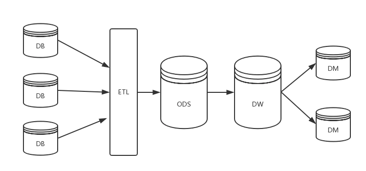
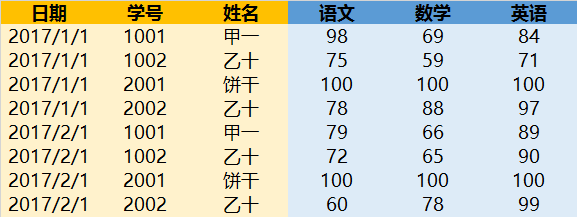

<!-- TOC -->

- [概念](#概念)
  - [Hadoop](#hadoop)
    - [HDFS](#hdfs)
    - [Map/Reduce](#mapreduce)
    - [YARN](#yarn)
  - [Hive](#hive)
  - [HBase](#hbase)
  - [Sqoop](#sqoop)
  - [Spark](#spark)
  - [Spark Streaming](#spark-streaming)
  - [OGG](#ogg)
  - [Flink](#flink)
  - [埋点采集](#埋点采集)
  - [平台架构](#平台架构)
    - [lambda架构](#lambda架构)
    - [kappa架构](#kappa架构)
  - [数据分类(数据视角)](#数据分类数据视角)
    - [数据治理-元数据](#数据治理-元数据)
  - [云服务](#云服务)
    - [基础架构即服务 (IaaS)](#基础架构即服务-iaas)
    - [平台即服务 (PaaS)](#平台即服务-paas)
    - [软件即服务 (SaaS)](#软件即服务-saas)
    - [三者对比](#三者对比)
    - [Serverless](#serverless)
  - [ETL](#etl)
    - [维度DIM和事实FACT](#维度dim和事实fact)
    - [字段类型](#字段类型)
    - [表类型](#表类型)
  - [维度建模](#维度建模)
    - [星型模式](#星型模式)
    - [雪花模式](#雪花模式)
    - [星座模式](#星座模式)

<!-- /TOC -->

# 概念

1. 数据同步和传输：Sqoop、OGG
2. 分布式计算框架：MapReduce、Spark、Spark Streamning、Flink
3. 数据媒介：Hive、HBase、Kafka
4. 核心：Hadoop（HDFS+MapReduce+YARN）

## Hadoop
Hadoop是一个分布式系统基础架构，充分利用集群的威力进行高速运算和存储，它解決了两大问题：

- 大数据存储（HDFS）
- 大数据分析（MapReduce）

也就是 Hadoop 的两大核心： HDFS 和 MapReduce

* HDFS(Hadoop Distributed File System)是可扩展、容错、高性能的分布式文件系统，异步复制，一次写入多次读取，主要负责存储。
* MapReduce 为分布式计算框架，包含map(映射)和 reduce(归约)过程，负责在 HDFS 上进行计算。
* YARN 资源管理架构（Yet Another Resource Manager）包括 ResourceManager（资源管理器）、ApplicationMaster、NodeManager（节点管理器）。

### HDFS
Hadoop实现了一个分布式文件系统（Hadoop Distributed File System），简称HDFS。

HDFS 是一个主从 Master/Slave 架构。一个 HDFS 集群包含一个 NameNode 和多个 DataNode 

NameNode 是一个 Master Server，用来管理文件系统的命名空间，以及调节客户端对文件的访问。
多个 DataNode，用来存储数据。

### Map/Reduce
MapReduce 是适合海量数据处理的编程模型。

MapReduce程序的工作分两个阶段进行：
1. Map阶段
2. Reduce阶段

### YARN
是一套资源统一管理和调度平台，可管理各种计算框架，包括MapReduce、Spark、MPI等。

- ResourceManager（RM） 负责全局的资源管理和任务调度，把整个集群当成计算资源池，只关注分配，不管应用，且不负责容错
- NodeManager（NM） 运行在每个节点上的进程
- ApplicationMaster 单个作业的资源管理和任务监控
- Container 基本的资源单位
- Failover 失败的处理

有个很有意思很形象的描述

如何用形象的比喻描述大数据的技术生态？Hadoop、Hive、Spark 之间是什么关系？ - 有点文的回答 - 知乎
https://www.zhihu.com/question/27974418/answer/156227565

## Hive
Hive是一个构建在Hadoop之上的数据仓库软件,它可以使已经存储的数据结构化，它提供类似sql的查询语句HiveQL对数据进行分析处理。

Hive将HiveQL语句转换成一系列成MapReduce作业并执行。

## HBase
HBase是一个高可靠性、高性能、面向列、可伸缩的分布式存储系统，利用HBase技术可在廉价PC Server上搭建起大规模结构化存储集群。HBase利用Hadoop HDFS作为其文件存储系统。

## Sqoop

Hadoop和RDB传送数据的工具，其实是一个命令行工具（命令->MR程序），完成MySQL、Oracle和HDFS、Hive、HBase之间的导入和导出。

## Spark
Spark是一个围绕速度、易用性和复杂分析构建的大数据处理框架，比MR更快。Spark 本身使用 Scala 语言编写，提供了 Java、Scala、Python、R 四种语言的 API。

基于Spark，可以用java等做算子开发，包含transformation（中间过程处理）和action（触发SparkContext提交Job作业，并输出）。

也可以使用Spark SQL，其也是一种SQL-on-Hadoop工具，Spark SQL 就是这样一个基于 SQL 的声明式编程接口。你可以将它看作在 Spark 之上的一层封装，在 RDD 计算模型的基础上，提供了 DataFrame API 以及一个内置的 SQL 执行计划优化器 Catalyst。

## Spark Streaming
Spark Streaming 是个批处理的流式（实时）计算框架。其基本原理是把输入数据以某一时间间隔批量的处理，当批处理间隔缩短到秒级时，便可以用于处理实时数据流。

支持从多种数据源获取数据，包括Kafk、Flume、Twitter、ZeroMQ、Kinesis以及TCP sockets，从数据源获取数据之后，可以使用诸如map、reduce、join等高级函数进行复杂算法的处理。最后还可以将处理结果存储到文件系统，数据库（HDFS、HBase）等。

## OGG

Oracle GoldenGate（OGG）是一种基于日志的结构化数据复制软件，利用抽取进程 (Extract Process)在源端数据库中读取Online Redo Log或者Archive Log，然后进行解析，只提取其中数据的变化信息，比如DML操作——增、删、改操作，将抽取的信息转换为GoldenGate自定义的中间格式存放在队列文件(trail file)中。再利用传输进程将队列文件 (trail file) 通过 TCP/IP传送到目标系统。

## Flink
分布式流处理计算框架，其核心是用Java和Scala编写的分布式流数据流引擎。Flink以数据并行和流水线方式执行任意流数据程序，Flink的流水线运行时系统可以执行批处理和流处理程序。

## 埋点采集

[关于数据埋点采集，你需要了解这些](http://www.woshipm.com/pd/3070837.html)

## 平台架构

[大数据平台架构设计探究](https://yq.aliyun.com/articles/740190)

### lambda架构

### kappa架构

## 数据分类(数据视角)

1. 主数据（Master Data）： 主数据是关于业务实体的数据，描述组织内的“物”，如：人，地点，客户，产品等。

2. 交易数据（事务数据，Transactional Data）：交易数据（事务数据、业务数据）描述组织业务运营过程中的内部或外部事件或交易记录。如：销售订单，通话记录等。

3. 参考数据（Reference Data）:参考数据是用于将其他数据进行分类或目录整编的数据，规定参考数据值是几个允许值之一。如：客户等级分为Ａ，Ｂ，Ｃ三级。

4. 统计分析数据（指标、Analytical Data）:统计分析数据是对企业业务活动进行统计分析的数值型数据，即：指标。如：客户到达数、数据接入率等。

5. 元数据（Meta Data）：元数据是描述数据的数据，帮助理解、获取、使用数据，分为技术元数据和业务元数据等。

### 数据治理-元数据

[什么是元数据以及元数据管理架构](https://zhuanlan.zhihu.com/p/110976711)

[数据仓库系列之元数据管理](https://www.jianshu.com/p/9635ecebf61e)

[数据治理--元数据](https://zoeminghong.github.io/2020/02/08/%E6%95%B0%E6%8D%AE%E6%B2%BB%E7%90%86%E5%85%83%E6%95%B0%E6%8D%AE/)

[大数据：事实表设计](https://www.cnblogs.com/volcao/p/13624274.html)

## 云服务

### 基础架构即服务 (IaaS)
Infrastructure-as-a-service

基础架构即服务 (IaaS) 是一种云计算产品，供应商为用户提供对服务器、存储和网络等计算资源的访问。

组织可以在服务提供商的基础架构中使用自己的平台和应用。

主要功能：
* 用户按需支付 IaaS，无需购买整套硬件。
* 可根据处理和存储需求扩展基础架构。
* 节省企业购买和维护硬件的成本。
* 由于数据位于云端，因此不会有单点故障。
* 支持管理任务虚拟化，腾出时间处理其他事务。

### 平台即服务 (PaaS)
Platform-as-a-service

平台即服务 (PaaS) 是一种云计算产品，为用户提供云环境，用于开发、管理和交付应用。

除存储器和其他计算资源以外，用户能够使用预构建工具套件，开发、定制和测试自己的应用。

主要功能：
* PaaS 提供平台，包含多种工具，用于在同一环境中测试、开发和运行应用。
* 使组织能够将精力集中于开发，无需担心底层基础架构。
* 供应商负责管理安全性、操作系统、服务器软件以及备份。
* 促进密切协作，即使团队远程工作也毫不影响。

### 软件即服务 (SaaS)
Software-as-a-service

软件即服务 (SaaS) 是一种云计算产品，为用户提供对供应商云端软件的访问。用户无需在其本地设备上安装应用。

相反，应用驻留在远程云网络中，通过 Web 或 API 进行访问。

通过应用，用户可以存储和分析数据，并可进行项目协作。

主要功能：
* SaaS 供应商通过预订模式向用户提供软件和应用。
* 用户不必管理、安装或升级软件；这一切都由 SaaS 供应商负责。
* 数据在云端受到保护；设备故障不会导致数据丢失。
* 可根据服务需求对资源用量进行扩展。
* 可以全球几乎任何地方，通过任何与互联网连接的设备访问应用。

比如：
* 团队协同服务 Google Apps
* 储存服务 Dropbox
* 社交服务 Facebook / Twitter / Instagram

### 三者对比

上图中，绿色的部分是云服务商决定的，紫色的部分是用户决定的。

可以看到，SaaS 模式下用户没有任何自主权，只能使用给定的应用程序；

PaaS 模式下可以自己安装应用程序，但是不能定制操作系统；

IaaS 模式下则是云服务商提供（虚拟的）硬件，从操作系统开始都可以自己选择和定制。

### Serverless

无服务器架构环境，不关注程序运行环境和底层物理架构

诞生了云开发产品

## ETL

### 维度DIM和事实FACT

### 字段类型

* 不可求和的是维度（黄）：日期、学号、姓名
* 可以求和的是度量（蓝）：语文、数学、英语成绩

具体的分数称为 度量值

### 表类型

* 维度表：同类型维度的集合，具有层次结构
* 事实表：由各维度表的主键及度量组成

两份维度表的主键【日期】和【学号】加上 3 种【成绩】的度量就可以构成事实表，一般加前缀 Fact

总的来说，数据仓库可以不用遵守严格的数据设计规范，因为DW主要面向分析，以查询为主，不涉及数据更新操作。

- 维度表：比较固定，数据量小；
- 事实表：能够正确记录历史信息。

## 维度建模

### 星型模式

以事实表为中心，所有的维度表直接连接在事实表上。

星型建模由一个事实表和多个维度表组成，具有以下特点：

1. DIM和FACT关联，DIM之间没有是没有关联的；
2. 每个DIM表主键为单列，作为事实表的外键；
3. 以FACT表为核心，DIM表围绕FACT表分布。

### 雪花模式

在星型模式的基础上，DIM表之间存在关联，维护成本高，实际应用中不广泛。

### 星座模式

星座模式是星型模式的延伸，星座模式基于多张事实表，并共享维度信息。

---

参考引用：

[什么是正确的数据储存姿势](https://zhuanlan.zhihu.com/p/25593304)

[IaaS、PaaS 和 SaaS - IBM Cloud 服务模型](https://www.ibm.com/cn-zh/cloud/learn/iaas-paas-saas)

[IaaS，PaaS，SaaS 的区别](http://www.ruanyifeng.com/blog/2017/07/iaas-paas-saas.html)

