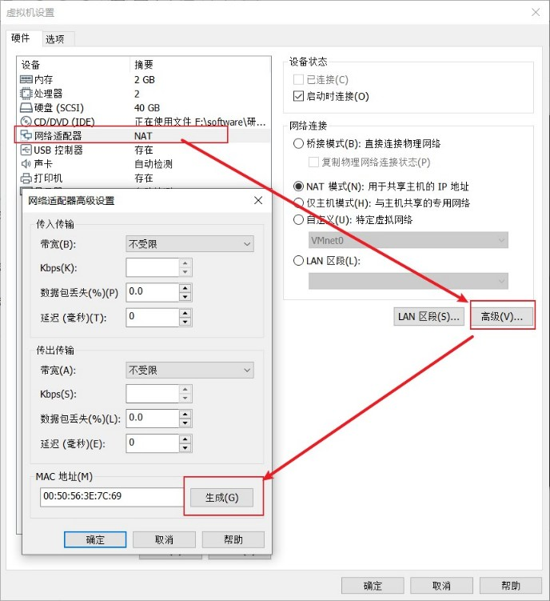
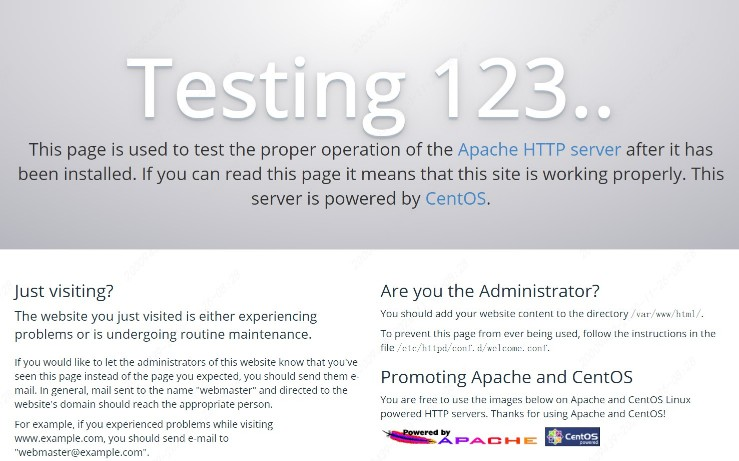
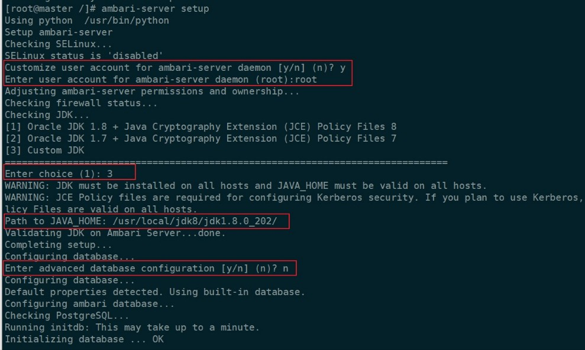
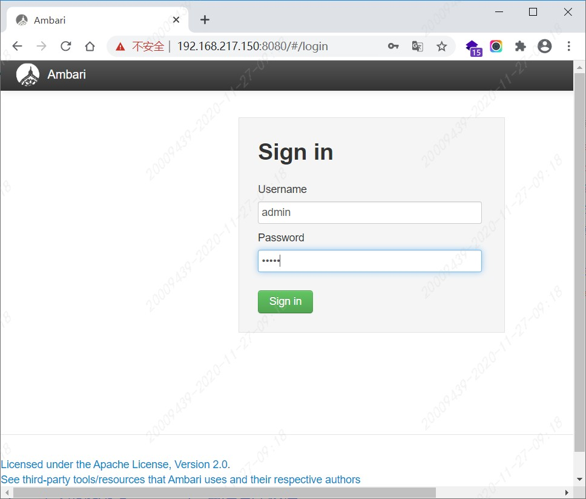
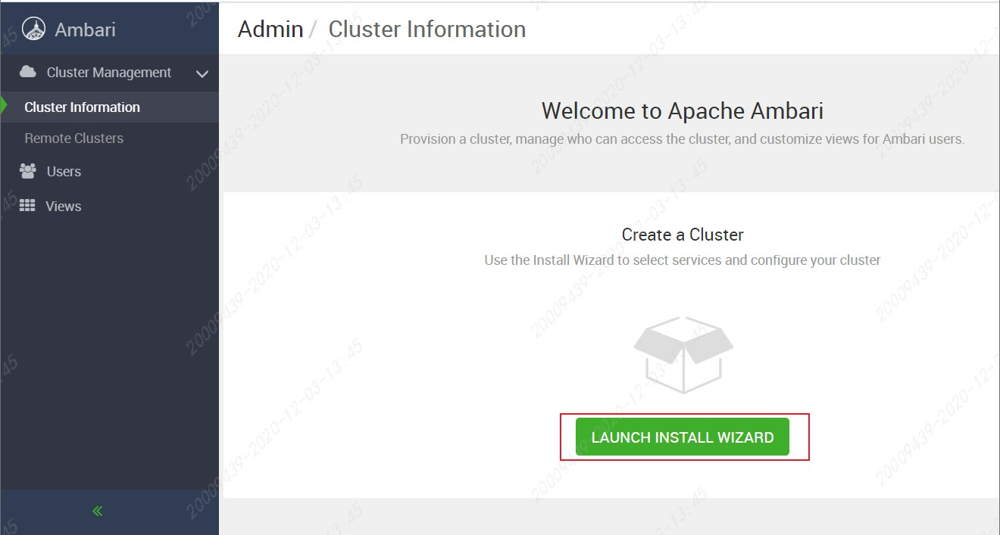
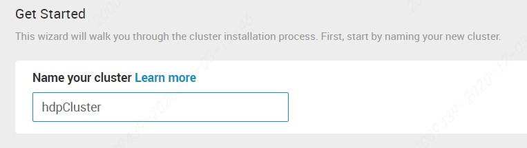
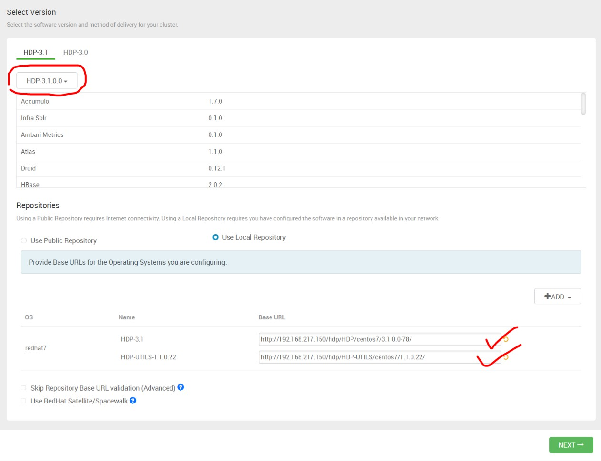
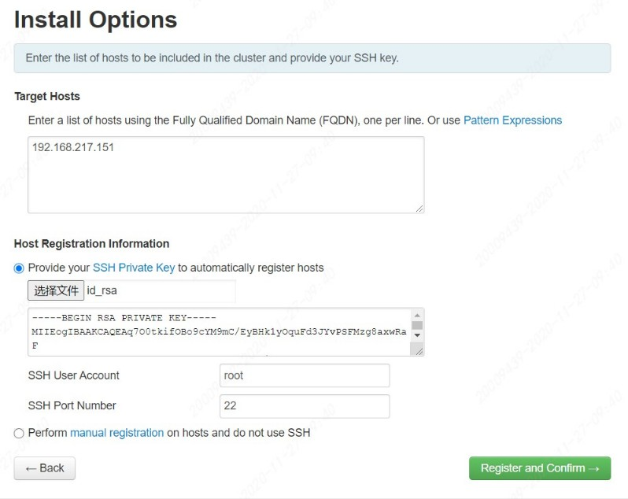
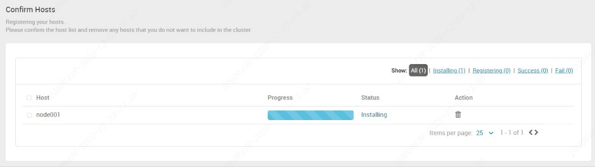
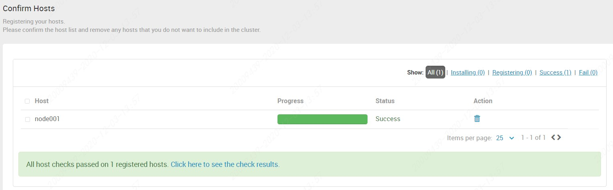

<!-- TOC -->

- [环境](#环境)
  - [网络配置](#网络配置)
    - [ip地址配置](#ip地址配置)
    - [hosts设置](#hosts设置)
    - [network设置](#network设置)
    - [关闭防火墙](#关闭防火墙)
    - [关闭SElinux](#关闭selinux)
    - [测试连通](#测试连通)
    - [物理主机host](#物理主机host)
    - [其他-物理主机虚拟网卡](#其他-物理主机虚拟网卡)
  - [时间同步及JDK](#时间同步及jdk)
    - [更改yum源](#更改yum源)
    - [时钟同步](#时钟同步)
    - [安装JDK](#安装jdk)
  - [相关服务](#相关服务)
  - [其他节点](#其他节点)
  - [免密登录](#免密登录)
  - [Ambari离线安装](#ambari离线安装)
    - [下载拷贝](#下载拷贝)
    - [安装httpd](#安装httpd)
    - [创建本地源](#创建本地源)
    - [配置本地源](#配置本地源)
  - [ambari-server](#ambari-server)
    - [安装](#安装)
    - [启动配置](#启动配置)
  - [Hadoop集群](#hadoop集群)
    - [创建集群](#创建集群)

<!-- /TOC -->

<a id="markdown-环境" name="环境"></a>
# 环境

基本环境：

- VMware 15，虚拟机虚拟网卡设置为主机模式
- CentOS 7.6
- ambari-2.7.3.0
- HDP-3.1.0.0
- HDP-UTILS-1.1.0.22
- jdk-8u202-linux-x64

机器名 | IP | 备注
----|----|---
master | 192.168.217.150 | 主节点 centos 7.6
node001 | 192.168.217.151 | 子节点 centos 7.6

注意此处`192.168.217.x`217段是随机生成，并不是特殊设置，当然也可以通过【vmnetcfg.exe】进行修改调整。

建议每个节点硬盘容量40G.

修改master主机名称：

```shell
hostnamectl set-hostname master
hostname master
```

<a id="markdown-网络配置" name="网络配置"></a>
## 网络配置

下面以主节点`master`的配置为例说明，子节点`node001`的配置可以通过克隆虚拟机实现。

在终端中输入命令 `ifconfig` 观察ip配置：

```shell
ifconfig
```

针对centos7+有所区分，命令：`ip addr`

```shell
[root@master ~]# ip addr
1: lo: <LOOPBACK,UP,LOWER_UP> mtu 65536 qdisc noqueue state UNKNOWN group default qlen 1000
    link/loopback 00:00:00:00:00:00 brd 00:00:00:00:00:00
    inet 127.0.0.1/8 scope host lo
       valid_lft forever preferred_lft forever
    inet6 ::1/128 scope host 
       valid_lft forever preferred_lft forever
2: ens33: <BROADCAST,MULTICAST,UP,LOWER_UP> mtu 1500 qdisc pfifo_fast state UP group default qlen 1000
    link/ether 00:0c:29:1e:6a:79 brd ff:ff:ff:ff:ff:ff
    inet 192.168.217.150/24 brd 192.168.217.255 scope global noprefixroute ens33
       valid_lft forever preferred_lft forever
    inet6 fe80::9cea:c941:7028:1842/64 scope link tentative noprefixroute dadfailed 
       valid_lft forever preferred_lft forever
    inet6 fe80::ad86:a254:275d:afaa/64 scope link noprefixroute 
       valid_lft forever preferred_lft forever

```

<a id="markdown-ip地址配置" name="ip地址配置"></a>
### ip地址配置

Centos6+设置ip
```shell
[root@master ~]# vi /etc/sysconfig/network-scripts/ifcfg-eth0 
```

Centos7+设置ip
```shell
[root@master ~]# vi /etc/sysconfig/network-scripts/ifcfg-ens33
```

修改内容如下：

```shell
TYPE=Ethernet
PROXY_METHOD=none
BROWSER_ONLY=no
BOOTPROTO=static
DEFROUTE=yes
IPV4_FAILURE_FATAL=no
IPV6INIT=yes
IPV6_AUTOCONF=yes
IPV6_DEFROUTE=yes
IPV6_FAILURE_FATAL=no
IPV6_ADDR_GEN_MODE=stable-privacy
NAME=ens33
UUID=336276cd-5934-4f49-89bb-250c19ecc826
DEVICE=ens33
ONBOOT=yes
IPADDR=192.168.217.150
NETMASK=255.255.255.0
GATEWAY=192.168.217.2
DNS1=192.168.217.2
DNS2=114.114.114.114
```

修改 `BOOTPROTO` 为静态 `static` ，并设置 `IPADDR` , `NETMASK` , `GATEWAY` 

如要联网还需要进一步设置DNS，如上配置了两个DNS，一个是网关，另一个是114。

<a id="markdown-hosts设置" name="hosts设置"></a>
### hosts设置

linux主机名的相关配置文件就是`/etc/hosts`

这个文件告诉主机那些域名对应那些ip,哪些主机名对应哪些ip， `vi` 命令修改【hosts】文件

```shell
[root@master ~]# vi /etc/hosts
```

添加内容如下：

```shell
127.0.0.1   loc
192.168.217.150 master
192.168.217.151 node001
```

<a id="markdown-network设置" name="network设置"></a>
### network设置
进行网络配置：

```shell
[root@master ~]# vi /etc/sysconfig/network
```

修改主机名称：

```shell
NETWORKING=yes
HOSTNAME=master
```

<a id="markdown-关闭防火墙" name="关闭防火墙"></a>
### 关闭防火墙
```shell
centos7
[root@master ~]# systemctl disable firewalld.service
[root@master ~]# systemctl stop firewalld.service

centos6
$ chkconfig iptables off
$ service iptables stop
$ chkconfig --list iptables
```

<a id="markdown-关闭selinux" name="关闭selinux"></a>
### 关闭SElinux

```shell
vi /etc/sysconfig/selinux
```

将`SELINUX=enforcing`改为`SELINUX=disabled`

```shell
# This file controls the state of SELinux on the system.
# SELINUX= can take one of these three values:
#     enforcing - SELinux security policy is enforced.
#     permissive - SELinux prints warnings instead of enforcing.
#     disabled - No SELinux policy is loaded.
SELINUX=disabled
# SELINUXTYPE= can take one of three values:
#     targeted - Targeted processes are protected,
#     minimum - Modification of targeted policy. Only selected processes are protected.
#     mls - Multi Level Security protection.
SELINUXTYPE=targeted
```

<a id="markdown-测试连通" name="测试连通"></a>
### 测试连通

完成以上设置后，重启网络

```shell
service network restart
```

重启后，可在linux中使用 `ping` 命令测试与物理主机的连通。

```shell
ping 192.168.217.1
```

同样，也可以 ping 命令测试虚拟机IP和主机名是否生效：

```shell
ping master
ping 192.168.217.150
```

<a id="markdown-物理主机host" name="物理主机host"></a>
### 物理主机host
可以通过设置物理主机的host文件，通过主机名进行 ping 

默认路径为【C:\Windows\System32\drivers\etc\hosts】，新增如下配置：

```shell
# master
192.168.217.150 master
```

在物理主机命令提示符中，即可通过虚拟主机名进行通信：

```shell
C:\Users\xxxxx>ping master

正在 Ping master [192.168.217.150] 具有 32 字节的数据:
来自 192.168.217.150 的回复: 字节=32 时间<1ms TTL=64
来自 192.168.217.150 的回复: 字节=32 时间<1ms TTL=64
来自 192.168.217.150 的回复: 字节=32 时间<1ms TTL=64
来自 192.168.217.150 的回复: 字节=32 时间<1ms TTL=64
```

注意，修改hosts文件需要有管理员权限！

<a id="markdown-其他-物理主机虚拟网卡" name="其他-物理主机虚拟网卡"></a>
### 其他-物理主机虚拟网卡

虚拟机网卡为“主机”模式，虚拟主机网卡与物理主机【VMware Network Adapter VMnet1】网卡为同一网段，即可以通讯。

在物理主机中，可以通过在命令提示符中输入： `ipconfig` 命令，观察 VMnet1 网卡的IP地址；

或者在VMware安装路径下【vmnetcfg.exe】程序中找到主机模式下的IP地址。

<a id="markdown-时间同步及jdk" name="时间同步及jdk"></a>
## 时间同步及JDK
<a id="markdown-更改yum源" name="更改yum源"></a>
### 更改yum源

如果是centos最小安装，则需要通过yum安装wget
```shell
yum isntall -y wget
```

```shell
#备份原镜像
[root@master ~]# mv /etc/yum.repos.d/CentOS-Base.repo /etc/yum.repos.d/CentOS-Base.repo.backup
[root@master ~]# cd /etc/yum.repos.d/

#centos 7 
[root@localhost yum.repos.d]# wget http://mirrors.163.com/.help/CentOS7-Base-163.repo
#centos 6 
[root@localhost yum.repos.d]# wget http://mirrors.163.com/.help/CentOS6-Base-163.repo
#------------------------#
[root@localhost yum.repos.d]# yum clean all
[root@localhost yum.repos.d]# yum makecache
```

<a id="markdown-时钟同步" name="时钟同步"></a>
### 时钟同步

```shell
# 安装同步服务
[root@master ~] yum install -y ntp

# centos6 设置开机启动
[root@master ~] chkconfig ntpd on

# centos7 查看服务是否已运行
[root@master ~] systemctl | grep ntpd
[root@master ~] systemctl is-enabled ntpd
[root@master ~] systemctl enable ntpd
[root@master ~] systemctl start ntpd
```

<a id="markdown-安装jdk" name="安装jdk"></a>
### 安装JDK

如果原本环境中已有jdk，但并非是目标版本则需要卸载之

```shell
yum remove *openjdk*
```

安装oracle JDK1.8

```shell
[root@master ~]# cd /usr/local
[root@localhost local]# mkdir jdk8
```

复制下载好的linux版JDK1.8到 `/usr/local/jdk8`目录，上传工具可以选择 `yum -y install lrzsz`

```shell
[root@localhost local]# cd jdk8
[root@master jdk8]# tar -zxvf jdk-8u151-linux-x64.tar.gz 
```

配置jdk环境变量

```shell
[root@master jdk8]# vi /etc/profile
#java
export JAVA_HOME=/usr/local/jdk8/jdk1.8.0_202
export JRE_HOME=$JAVA_HOME/jre
export CLASSPATH=.:$JAVA_HOME/lib:$JRE_HOME/lib
export PATH=$PATH:$JAVA_HOME/bin
```

使环境变量生效

```shell
[root@master jdk8]# source /etc/profile
```

<a id="markdown-相关服务" name="相关服务"></a>
## 相关服务

```shell
#设定用户所创建目录的初始权限
umask 0022

yum -y install lrzsz

yum install -y openssh-clients
```

<a id="markdown-其他节点" name="其他节点"></a>
## 其他节点

其余节点虚拟机的配置可以采用克隆的方式，不用每台机器重新进行配置。

建议克隆后，修改新节点的虚拟网卡物理地址，在centos6环境下克隆节点会出现网卡无法识别的情况：



解决Bringing up interface eth0: Device eth0 does not seem to be present, delaying initialization.

https://www.cnblogs.com/red-code/p/10342779.html

克隆完成后：

修改主机名称：
```shell
hostnamectl set-hostname node001
hostname node001
```

修改ip地址：
```shell
vi /etc/sysconfig/network-scripts/ifcfg-ens33
# 修改为151
# IPADDR=192.168.217.151
# 注释掉UUID，克隆主机防止重复
#UUID=fc598c8e-a7c7-4a13-a9ca-xxxxxxxxxxx
```

```shell
[root@master ~]# vi /etc/sysconfig/network
```

修改主机名称：

```shell
NETWORKING=yes
HOSTNAME=node001
```

<a id="markdown-免密登录" name="免密登录"></a>
## 免密登录
该步骤操作仅在master节点操作即可，在master节点生成密钥文件：

```shell
[root@master ~]# ssh-keygen -t rsa
```

```
Generating public/private rsa key pair.
Enter file in which to save the key (/root/.ssh/id_rsa): 
Created directory '/root/.ssh'.
Enter passphrase (empty for no passphrase): 
Enter same passphrase again: 
Your identification has been saved in /root/.ssh/id_rsa.
Your public key has been saved in /root/.ssh/id_rsa.pub.
The key fingerprint is:
SHA256:GuxmdsEnsrePZ3rqqBpNROUVH7jcnB6E8D0rDPgOsN0 root@master
The key's randomart image is:
+---[RSA 2048]----+
|    ..o.o+.      |
|   . o ooo..     |
|  . o o..=+.     |
|   = + +o =o     |
|  . + E S.o.     |
|   o + = =.      |
|  . . O o        |
|   . + + o+      |
|  ......*B.      |
+----[SHA256]-----+
```

中间过程默认回车即可，在【/root/.ssh/】目录下会生成id_rsa文件，id_rsa为私钥文件，id_rsa.pub为公钥文件

将公钥拷贝至子节点node001

```shell
[root@master .ssh]# ssh-copy-id -i ~/.ssh/id_rsa.pub root@192.168.217.151
```

```
/usr/bin/ssh-copy-id: INFO: Source of key(s) to be installed: "/root/.ssh/id_rsa.pub"
The authenticity of host '192.168.217.151 (192.168.217.151)' can't be established.
ECDSA key fingerprint is SHA256:5H0b+okMtkVVpVy5jkr1Cu+53waN/WWU9Col8j/xd4s.
ECDSA key fingerprint is MD5:ee:f7:0d:e8:f5:2e:0e:49:8e:81:c5:8e:6d:03:fa:18.
Are you sure you want to continue connecting (yes/no)? yes
/usr/bin/ssh-copy-id: INFO: attempting to log in with the new key(s), to filter out any that are already installed
/usr/bin/ssh-copy-id: INFO: 1 key(s) remain to be installed -- if you are prompted now it is to install the new keys
root@192.168.217.151's password: 

Number of key(s) added: 1

Now try logging into the machine, with:   "ssh 'root@192.168.217.151'"
and check to make sure that only the key(s) you wanted were added.
```

master测试免密登录node001：

```shell
# 在master测试免密码登陆node
[root@master /]# ssh 192.168.217.151
Last login: Wed Nov 25 13:25:33 2020 from 192.168.217.1
[root@node001 ~]# 
[root@node001 ~]# exit
登出
Connection to 192.168.217.151 closed.
[root@master /]# 
```

<a id="markdown-ambari离线安装" name="ambari离线安装"></a>
## Ambari离线安装

<a id="markdown-下载拷贝" name="下载拷贝"></a>
### 下载拷贝
下载 Ambari与HDP 官网 [Hortonworks](https://docs.cloudera.com/)

```
http://public-repo-1.hortonworks.com/ambari/centos7/2.x/updates/2.7.3.0/ambari-2.7.3.0-centos7.tar.gz
http://public-repo-1.hortonworks.com/HDP/centos7/3.x/updates/3.1.0.0/HDP-3.1.0.0-centos7-rpm.tar.gz
http://public-repo-1.hortonworks.com/HDP-UTILS-1.1.0.22/repos/centos7/HDP-UTILS-1.1.0.22-centos7.tar.gz
```

使用ftp将物理主机中已下载好的三个文件上传至master节点【/var/ftp/pub】路径下

<a id="markdown-安装httpd" name="安装httpd"></a>
### 安装httpd

```shell
[root@master ~]# yum install yum-utils createrepo yum-plugin-priorities -y
#添加 gpgcheck=0
[root@master ~]# vi /etc/yum/pluginconf.d/priorities.conf
```

```
[main]
enabled = 1
gpgcheck = 0
```

配置http服务

```shell
#检查是否安装httpd 
[root@master ~]# yum list httpd
#未安装则安装httpd
[root@master ~]# yum install -y httpd
#配置HTTP 服务到系统层使其随系统自动启动
[root@master ~]# chkconfig httpd on
[root@master ~]# service httpd start
```

测试访问`http://192.168.217.150/`，即默认端口80，通过浏览器访问页面如下：



web程序根目录：【/var/www/html】，可以测试将静态页面文件上传至此目录，并通过浏览器访问测试。

<a id="markdown-创建本地源" name="创建本地源"></a>
### 创建本地源

将下载的3个tar包解压到/var/www/html 相应目录下

```shell
[root@master ~]# cd /var/www/html/
[root@master html]# mkdir ambari
[root@master ambari]# cd ..
[root@master html]# mkdir hdp
```

将资源解压到指定位置：

```shell
[root@master pub]# cd /var/ftp/pub
[root@master pub]# ll
总用量 10844988
-rw------- 1 ftp ftp 1947685893 12月  3 09:11 ambari-2.7.3.0-centos7.tar.gz
-rw------- 1 ftp ftp 9066967592 12月  3 09:12 HDP-3.1.0.0-centos7-rpm.tar.gz
-rw------- 1 ftp ftp   90606616 12月  3 09:11 HDP-UTILS-1.1.0.22-centos7.tar.gz


[root@master pub]# tar -zxvf ambari-2.7.3.0-centos7.tar.gz -C /var/www/html/ambari
[root@master pub]# tar -zxvf HDP-3.1.0.0-centos7-rpm.tar.gz -C /var/www/html/hdp
[root@master pub]# tar -zxvf HDP-UTILS-1.1.0.22-centos7.tar.gz -C /var/www/html/hdp
```

createrepo

```shell
[root@master home]# cd /var/www/html/ambari/
[root@master ambari]# createrepo ./
```

```
Spawning worker 0 with 12 pkgs
Workers Finished
Saving Primary metadata
Saving file lists metadata
Saving other metadata
Generating sqlite DBs
Sqlite DBs complete
```

<a id="markdown-配置本地源" name="配置本地源"></a>
### 配置本地源

下载ambari.repo　HDP.repo，配置为本地源

```shell
[root@master ambari]# cd /etc/yum.repos.d/
[root@master yum.repos.d]# ll
总用量 40
-rw-r--r--  1 root root 1572 12月  1 2016 CentOS7-Base-163.repo
-rw-r--r--. 1 root root 1664 4月   8 2020 CentOS-Base.repo.backup
-rw-r--r--. 1 root root 1309 4月   8 2020 CentOS-CR.repo
-rw-r--r--. 1 root root  649 4月   8 2020 CentOS-Debuginfo.repo
-rw-r--r--. 1 root root  314 4月   8 2020 CentOS-fasttrack.repo
-rw-r--r--. 1 root root  630 4月   8 2020 CentOS-Media.repo
-rw-r--r--. 1 root root 1331 4月   8 2020 CentOS-Sources.repo
-rw-r--r--. 1 root root 7577 4月   8 2020 CentOS-Vault.repo
-rw-r--r--. 1 root root  616 4月   8 2020 CentOS-x86_64-kernel.repo
```

```shell
[root@master yum.repos.d]# wget -nv http://public-repo-1.hortonworks.com/ambari/centos7/2.x/updates/2.7.3.0/ambari.repo
[root@master yum.repos.d]# vi ambari.repo
```

修改配置`gpgcheck=0`，`baseurl`和`gpgkey`的配置，对应到master节点httpd应用的指定位置。

```
#VERSION_NUMBER=2.7.3.0-139
[ambari-2.7.3.0]
#json.url = http://public-repo-1.hortonworks.com/HDP/hdp_urlinfo.json
name=ambari Version - ambari-2.7.3.0
#baseurl=http://public-repo-1.hortonworks.com/ambari/centos7/2.x/updates/2.7.3.0
baseurl=http://192.168.217.150/ambari/ambari/centos7/2.7.3.0-139/
gpgcheck=0
#gpgkey=http://public-repo-1.hortonworks.com/ambari/centos7/2.x/updates/2.7.3.0/RPM-GPG-KEY/RPM-GPG-KEY-Jenkins
gpgkey=http://192.168.217.150/ambari/ambari/centos7/2.7.3.0-139/RPM-GPG-KEY/RPM-GPG-KEY-Jenkins
enabled=1
priority=1
```

配置HDP repo

```shell
[root@master yum.repos.d]# wget -nv http://public-repo-1.hortonworks.com/HDP/centos7/3.x/updates/3.1.0.0/hdp.repo
[root@master yum.repos.d]# vi hdp.repo
```

同样的，修改配置`gpgcheck=0`，`baseurl`和`gpgkey`的配置，对应到master节点httpd应用的指定位置。

```
#VERSION_NUMBER=3.1.0.0-78
[HDP-3.1.0.0]
name=HDP Version - HDP-3.1.0.0
#baseurl=http://public-repo-1.hortonworks.com/HDP/centos7/3.x/updates/3.1.0.0
baseurl=http://192.168.217.150/hdp/HDP/centos7/3.1.0.0-78/
gpgcheck=0
#gpgkey=http://public-repo-1.hortonworks.com/HDP/centos7/3.x/updates/3.1.0.0/RPM-GPG-KEY/RPM-GPG-KEY-Jenkins
gpgkey=http://192.168.217.150/hdp/HDP/centos7/3.1.0.0-78/RPM-GPG-KEY/RPM-GPG-KEY-Jenkins
enabled=1
priority=1


[HDP-UTILS-1.1.0.22]
name=HDP-UTILS Version - HDP-UTILS-1.1.0.22
#baseurl=http://public-repo-1.hortonworks.com/HDP-UTILS-1.1.0.22/repos/centos7
baseurl=http://192.168.217.150/hdp/HDP-UTILS/centos7/1.1.0.22/
gpgcheck=0
#gpgkey=http://public-repo-1.hortonworks.com/HDP/centos7/3.x/updates/3.1.0.0/RPM-GPG-KEY/RPM-GPG-KEY-Jenkins
gpgkey=http://192.168.217.150/hdp/HDP-UTILS/centos7/1.1.0.22/RPM-GPG-KEY/RPM-GPG-KEY-Jenkins
enabled=1
priority=1
```

执行命令更新yum源

```shell
[root@master yum.repos.d]# yum clean all
[root@master yum.repos.d]# yum makecache
```

检查仓库是否可用

```shell
[root@master yum.repos.d]# yum repolist
```

在repolist中检查是否有

- `ambari-2.7.3.0`
- `HDP-3.1.0.0`
- `HDP-UTILS-1.1.0.22`

将`ambari.repo`和`hdp.repo`两个文件拷贝至cluster节点【/etc/yum.repos.d/】目录内，

```shell
yum clean all
yum makecache
```

<a id="markdown-ambari-server" name="ambari-server"></a>
## ambari-server

<a id="markdown-安装" name="安装"></a>
### 安装

```shell
# 安装ambari-server
[root@master ~]# yum install -y ambari-server
```

配置ambari-server：

```shell
ambari-server setup
```

注意下图中红框标注的输入项：



注意：Ambari默认使用postgreSQL

<a id="markdown-启动配置" name="启动配置"></a>
### 启动配置

查看并启动`Ambari-server`

```shell
[root@master /]# service ambari-server start
```

```
Using python  /usr/bin/python
Starting ambari-server
Ambari Server running with administrator privileges.
Organizing resource files at /var/lib/ambari-server/resources...
Ambari database consistency check started...
Server PID at: /var/run/ambari-server/ambari-server.pid
Server out at: /var/log/ambari-server/ambari-server.out
Server log at: /var/log/ambari-server/ambari-server.log
Waiting for server start.................................
Server started listening on 8080

DB configs consistency check: no errors and warnings were found.
Ambari Server 'start' completed successfully.
```

登陆Ambari 默认用户名/密码：admin/admin 地址：http://192.168.217.150:8080



主界面：



<a id="markdown-hadoop集群" name="hadoop集群"></a>
## Hadoop集群

<a id="markdown-创建集群" name="创建集群"></a>
### 创建集群



集群名称：`hdpCluster`

选择对应 HDP 版本，选择本地库安装，多余的os项可以移除掉：



配置子节点，并上传master私钥



注意如果不是在master本机上访问ambari-server直接浏览是找不到密钥的

需要将master节点上【~/.ssh/id_rsa】下载到本地，再上传至ambari-server

正在安装中。。。



安装成功！




---

参考引用：

[ambari介绍及安装](https://www.cnblogs.com/xuliang666/p/11381225.html)

[兼容性检查](https://supportmatrix.hortonworks.com/)

[ambari2.7.3离线安装](https://www.jianshu.com/p/25df5ab42110)


