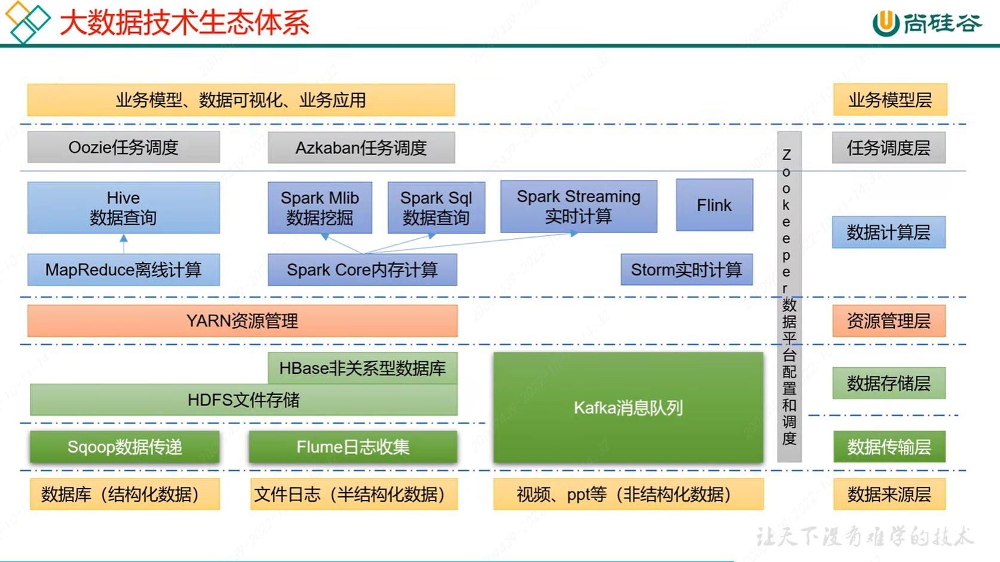

<!-- TOC -->

- [hadoop](#hadoop)
  - [生态体系](#生态体系)
  - [集群安装](#集群安装)
    - [基础环境](#基础环境)
      - [前期ip网络、host配置](#前期ip网络host配置)
      - [设置软件库](#设置软件库)
      - [配置用户【atguigu】](#配置用户atguigu)
      - [归属配置](#归属配置)
      - [卸载虚拟机自带的 jdk](#卸载虚拟机自带的-jdk)
    - [hadoop安装](#hadoop安装)
    - [克隆节点](#克隆节点)
  - [运行模式及准备](#运行模式及准备)
    - [运行模式](#运行模式)
    - [脚本下发](#脚本下发)
    - [免密登录设置](#免密登录设置)
  - [配置集群](#配置集群)
    - [集群基础](#集群基础)
    - [配置【core-site.xml】](#配置core-sitexml)
    - [配置【hdfs-site.xml】](#配置hdfs-sitexml)
    - [配置【yarn-site.xml】](#配置yarn-sitexml)
    - [配置【mapred-site.xml】](#配置mapred-sitexml)
    - [分发配置到各集群](#分发配置到各集群)
    - [群起集群](#群起集群)
      - [配置works](#配置works)
      - [初始化NameNode](#初始化namenode)
      - [启动hdfs](#启动hdfs)

<!-- /TOC -->

<a id="markdown-hadoop" name="hadoop"></a>
# hadoop

<a id="markdown-生态体系" name="生态体系"></a>
## 生态体系




<a id="markdown-集群安装" name="集群安装"></a>
## 集群安装

<a id="markdown-基础环境" name="基础环境"></a>
### 基础环境

<a id="markdown-前期ip网络host配置" name="前期ip网络host配置"></a>
#### 前期ip网络、host配置

```shell
vi /etc/sysconfig/network-scripts/ifcfg-ens33
```

```shell
TYPE=Ethernet
PROXY_METHOD=none
BROWSER_ONLY=no
BOOTPROTO=static
DEFROUTE=yes
IPV4_FAILURE_FATAL=no
IPV6INIT=yes
IPV6_AUTOCONF=yes
IPV6_DEFROUTE=yes
IPV6_FAILURE_FATAL=no
IPV6_ADDR_GEN_MODE=stable-privacy
NAME=ens33
UUID=64bc05ba-09a0-44a1-9bb0-41af7cb70272
DEVICE=ens33
ONBOOT=yes
IPADDR=192.168.217.102
NETMASK=255.255.255.0
GATEWAY=192.168.217.2
DNS1=192.168.217.2
DNS2=114.114.114.114

```

```shell
# 修改主机名称 
hostnamectl set-hostname hadoop102
hostname hadoop102

# 修改host名称
vi /etc/hosts

127.0.0.1   loc

192.168.217.102 hadoop102
192.168.217.103 hadoop103
192.168.217.104 hadoop104

```

<a id="markdown-设置软件库" name="设置软件库"></a>
#### 设置软件库

```shell
# 针对rhel配置软件库：
yum install -y epel-release

# 关闭防火墙
systemctl stop firewalld
# 关闭开机启动
systemctl disable firewalld.service

```

<a id="markdown-配置用户atguigu" name="配置用户atguigu"></a>
#### 配置用户【atguigu】

```shell
# 创建atguigu用户，并修改atguigu用户的密码
useradd atguigu
passwd atguigu

# 配置atguigu用户具有root权限，方便后期加sudo执行root权限的命令
vi /etc/sudoers

```

在%wheel这行下面添加一行 

```shell
## Allow root to run any commands anywhere
root    ALL=(ALL)     ALL

## Allows people in group wheel to run all commands
%wheel  ALL=(ALL)       ALL
atguigu   ALL=(ALL)     NOPASSWD:ALL

```

注意：atguigu这一行不要直接放到root行下面，

因为所有用户都属于wheel组，你先配置了atguigu具有免密功能，

但是程序执行到%wheel行时，该功能又被覆盖回需要密码。

所以atguigu要放到%wheel这行下面。

<a id="markdown-归属配置" name="归属配置"></a>
#### 归属配置

```shell
# 存放各软件包
mkdir /opt/software
# 存放各软件运行环境
mkdir /opt/module

# 修改module、software文件夹的所有者和所属组均为atguigu用户
chown atguigu:atguigu /opt/module
chown atguigu:atguigu /opt/software
```

<a id="markdown-卸载虚拟机自带的-jdk" name="卸载虚拟机自带的-jdk"></a>
#### 卸载虚拟机自带的 jdk 

```shell
# rpm -qa 查询rpm软件包
# grep -i 忽略大小写
# xargs -n1 每次只传递一个参数
# rpm -e -nodeps 强制卸载
rpm -qa | grep -i java | xargs -n1 rpm -e --nodeps
```

jdk安装：

```shell
# 解压至指定目录
tar -zxvf jdk-8u202-linux-x64.tar.gz -C /opt/module

# 配置环境变量
vi /etc/profile.d/my_env.sh
```

【my_env.sh】编辑内容：

```shell
# JAVA_HOME
export JAVA_HOME=/opt/module/jdk1.8.0_202
export PATH=$PATH:$JAVA_HOME/bin
```

```shell
# 生效环境变量
source /etc/profile

# 测试java
java -version
```

<a id="markdown-hadoop安装" name="hadoop安装"></a>
### hadoop安装

下载地址：https://archive.apache.org/dist/hadoop/common/hadoop-3.1.3/

下载安装包【hadoop-3.1.3.tar.gz】

```shell
# 解压hadoop压缩包
tar -zxvf /opt/software/hadoop-3.1.3.tar.gz -C /opt/module

# pwd
/opt/module/hadoop-3.1.3

# vi /etc/profile.d/my_env.sh
```

添加以下配置：

```shell
# HADOOP_HOME
export HADOOP_HOME=/opt/module/hadoop-3.1.3
export PATH=$PATH:$HADOOP_HOME/bin
export PATH=$PATH:$HADOOP_HOME/sbin
```


```shell
# 使文件生效
source /etc/profile

# hadoop version
Hadoop 3.1.3
Source code repository https://gitbox.apache.org/repos/asf/hadoop.git -r ba631c436b806728f8ec2f54ab1e289526c90579
Compiled by ztang on 2019-09-12T02:47Z
Compiled with protoc 2.5.0
From source with checksum ec785077c385118ac91aadde5ec9799
This command was run using /opt/module/hadoop-3.1.3/share/hadoop/common/hadoop-common-3.1.3.jar

```

hadoop 重要目录：

1. bin目录：存放对Hadoop相关服务（hdfs，yarn，mapred）进行操作的脚本
2. etc目录：Hadoop的配置文件目录，存放Hadoop的配置文件
3. lib目录：存放Hadoop的本地库（对数据进行压缩解压缩功能）
4. sbin目录：存放启动或停止Hadoop相关服务的脚本
5. share目录：存放Hadoop的依赖jar包、文档、和官方案例

<a id="markdown-克隆节点" name="克隆节点"></a>
### 克隆节点

利用刚配置好的 hadoop102 ，克隆生成 hadoop103 hadoop104

并修改ip地址和主机名称。


<a id="markdown-运行模式及准备" name="运行模式及准备"></a>
## 运行模式及准备

<a id="markdown-运行模式" name="运行模式"></a>
### 运行模式

Hadoop运行模式包括：

- 本地模式
- 伪分布式模式
- 完全分布式模式

<a id="markdown-脚本下发" name="脚本下发"></a>
### 脚本下发

```shell
vi /bin/xsync

# 内容如下：
#!/bin/bash

#1. 判断参数个数
if [ $# -lt 1 ]
then
    echo Not Enough Arguement!
    exit;
fi

#2. 遍历集群所有机器
for host in hadoop103 hadoop104
do
    echo ====================  $host  ====================
    #3. 遍历所有目录，挨个发送

    for file in $@
    do
        #4. 判断文件是否存在
        if [ -e $file ]
            then
                #5. 获取父目录
                pdir=$(cd -P $(dirname $file); pwd)

                #6. 获取当前文件的名称
                fname=$(basename $file)
                ssh $host "mkdir -p $pdir"
                rsync -av $pdir/$fname $host:$pdir
            else
                echo $file does not exists!
        fi
    done
done

```

```shell
# 赋予脚本权限
chmod 775 /bin/xsync
```

测试使用下发脚本拷贝文件至集群其他机器：

```shell
cd /opt/software

# 测试文件同步至其他节点同路径
xsync /opt/software/test_xia_fa
```

<a id="markdown-免密登录设置" name="免密登录设置"></a>
### 免密登录设置

```shell
# 远程登录 hadoop103 机器，会生成 ~/.ssh 隐藏文件夹
ssh hadoop103

cd ~/.ssh

# 生成公钥和密钥 默认参数（直接回车即可）
ssh-keygen -t rsa

# 拷贝公钥到免密登录的机器
ssh-copy-id hadoop102 # 本机也要拷贝，否则hadoop启动namenode报无权限
ssh-copy-id hadoop103
ssh-copy-id hadoop104

```

集群内各节点最好都设置下ssh免密登录，以免后期从 hadoop103 登录到 hadoop102 时无权限

<a id="markdown-配置集群" name="配置集群"></a>
## 配置集群

<a id="markdown-集群基础" name="集群基础"></a>
### 集群基础

--   | hadoop102 | hadoop103 | hadoop104
-|-----------|-----------|----------
HDFS | NameNode/DataNode | DataNode | SecondaryNameNode/DataNode
YARN | NodeManager | ResourceManager/NodeManager | NodeManager

默认配置文件：

要获取的默认文件 | 文件存放在Hadoop的jar包中的位置
---------|---------------------
[core-default.xml] | hadoop-common-3.1.3.jar/core-default.xml
[hdfs-default.xml] | hadoop-hdfs-3.1.3.jar/hdfs-default.xml
[yarn-default.xml] | hadoop-yarn-common-3.1.3.jar/yarn-default.xml
[mapred-default.xml] | hadoop-mapreduce-client-core-3.1.3.jar/mapred-default.xml

自定义配置：

core-site.xml、hdfs-site.xml、yarn-site.xml、mapred-site.xml

四个配置文件存放在`$HADOOP_HOME/etc/hadoop`这个路径上，用户可以根据项目需求重新进行修改配置。

<a id="markdown-配置core-sitexml" name="配置core-sitexml"></a>
### 配置【core-site.xml】

```shell
cd $HADOOP_HOME/etc/hadoop

vi core-site.xml
```

配置内容如下：

```xml
<configuration>
    <!-- 指定NameNode的地址 -->
    <property>
        <name>fs.defaultFS</name>
        <value>hdfs://hadoop102:8020</value>
    </property>

    <!-- 指定hadoop数据的存储目录 -->
    <property>
        <name>hadoop.tmp.dir</name>
        <value>/opt/module/hadoop-3.1.3/data</value>
    </property>

    <!-- 配置HDFS网页登录使用的静态用户为 atguigu -->
    <property>
        <name>hadoop.http.staticuser.user</name>
        <value>atguigu</value>
    </property>
</configuration>

```

<a id="markdown-配置hdfs-sitexml" name="配置hdfs-sitexml"></a>
### 配置【hdfs-site.xml】

```shell
cd $HADOOP_HOME/etc/hadoop

vi hdfs-site.xml
```

配置内容如下：

```xml
<configuration>
	<!-- nn web端访问地址-->
	<property>
        <name>dfs.namenode.http-address</name>
        <value>hadoop102:9870</value>
    </property>
	<!-- 2nn web端访问地址-->
    <property>
        <name>dfs.namenode.secondary.http-address</name>
        <value>hadoop104:9868</value>
    </property>
</configuration>
```


<a id="markdown-配置yarn-sitexml" name="配置yarn-sitexml"></a>
### 配置【yarn-site.xml】

```shell
cd $HADOOP_HOME/etc/hadoop

vi yarn-site.xml
```

配置内容如下：

```xml
<configuration>
    <!-- 指定MR走shuffle -->
    <property>
        <name>yarn.nodemanager.aux-services</name>
        <value>mapreduce_shuffle</value>
    </property>

    <!-- 指定ResourceManager的地址-->
    <property>
        <name>yarn.resourcemanager.hostname</name>
        <value>hadoop103</value>
    </property>

    <!-- 环境变量的继承 hadoop3.2+版本不需要此配置 -->
    <property>
        <name>yarn.nodemanager.env-whitelist</name>
        <value>JAVA_HOME,HADOOP_COMMON_HOME,HADOOP_HDFS_HOME,HADOOP_CONF_DIR,CLASSPATH_PREPEND_DISTCACHE,HADOOP_YARN_HOME,HADOOP_MAPRED_HOME</value>
    </property>

</configuration>
```

<a id="markdown-配置mapred-sitexml" name="配置mapred-sitexml"></a>
### 配置【mapred-site.xml】

```shell
cd $HADOOP_HOME/etc/hadoop

vi mapred-site.xml
```

配置内容如下：

```xml
<configuration>

	<!-- 指定MapReduce程序运行在Yarn上 -->
    <property>
        <name>mapreduce.framework.name</name>
        <value>yarn</value>
    </property>

</configuration>
```

<a id="markdown-分发配置到各集群" name="分发配置到各集群"></a>
### 分发配置到各集群

```shell
[root@hadoop102 hadoop]# xsync /opt/module/hadoop-3.1.3/etc/hadoop/
==================== hadoop103 ====================
sending incremental file list
hadoop/
hadoop/core-site.xml
hadoop/hdfs-site.xml
hadoop/mapred-site.xml
hadoop/yarn-site.xml

sent 3,513 bytes  received 139 bytes  2,434.67 bytes/sec
total size is 107,770  speedup is 29.51
==================== hadoop104 ====================
sending incremental file list
hadoop/
hadoop/core-site.xml
hadoop/hdfs-site.xml
hadoop/mapred-site.xml
hadoop/yarn-site.xml

sent 3,513 bytes  received 139 bytes  7,304.00 bytes/sec
total size is 107,770  speedup is 29.51

```

<a id="markdown-群起集群" name="群起集群"></a>
### 群起集群

<a id="markdown-配置works" name="配置works"></a>
#### 配置works

```shell
vi /opt/module/hadoop-3.1.3/etc/hadoop/workers
```

内容如下：

```shell
hadoop102
hadoop103
hadoop104
```

注意：该文件中添加的内容结尾不允许有空格，文件中不允许有空行。

```shell
# 同步所有配置
xsync /opt/module/hadoop-3.1.3/etc/hadoop/

==================== hadoop103 ====================
sending incremental file list
hadoop/
hadoop/workers

sent 982 bytes  received 46 bytes  2,056.00 bytes/sec
total size is 107,790  speedup is 104.85
==================== hadoop104 ====================
sending incremental file list
hadoop/
hadoop/workers

sent 982 bytes  received 46 bytes  2,056.00 bytes/sec
total size is 107,790  speedup is 104.85

```


<a id="markdown-初始化namenode" name="初始化namenode"></a>
#### 初始化NameNode

```shell
[root@hadoop102 hadoop-3.1.3]# pwd
/opt/module/hadoop-3.1.3
# 首次格式化 NameNode
[root@hadoop102 hadoop-3.1.3]# hdfs namenode -format
..........

```

注意：格式化NameNode，会产生新的集群id，导致NameNode和DataNode的集群id不一致，集群找不到已往数据。

如果集群在运行过程中报错，需要重新格式化NameNode的话，一定要先停止namenode和datanode进程，

并且要删除所有机器的data和logs目录，然后再进行格式化。

<a id="markdown-启动hdfs" name="启动hdfs"></a>
#### 启动hdfs

```shell
vi /etc/profile.d/my_env.sh

# 新增内容如下
export HDFS_NAMENODE_USER=root
export HDFS_DATANODE_USER=root
export HDFS_SECONDARYNAMENODE_USER=root
export YARN_RESOURCEMANAGER_USER=root
export YARN_NODEMANAGER_USER=root

```

在各节点通过 jps 查看节点信息

```shell
# 启动集群
[root@hadoop102 hadoop-3.1.3]# sbin/start-dfs.sh


[root@hadoop102 ~]# jps
36450 NameNode
1443 Jps
36639 DataNode

[root@hadoop103 ~]# jps
2500 Jps
29893 DataNode

[root@hadoop104 ~]# jps
26982 DataNode
27110 SecondaryNameNode
130774 Jps

# 在配置了ResourceManager的节点（hadoop103）启动YARN
[root@hadoop103 hadoop-3.1.3]# cd /opt/module/hadoop-3.1.3/
[root@hadoop103 hadoop-3.1.3]# sbin/start-yarn.sh
```

Web端查看HDFS的NameNode
- 浏览器中输入： http://hadoop102:9870 或者 http://192.168.217.102:9870/
- 查看HDFS上存储的数据信息

Web端查看YARN的ResourceManager
- 浏览器中输入： http://hadoop103:8088 或者 http://192.168.217.103:8088/
- 查看YARN上运行的Job信息


